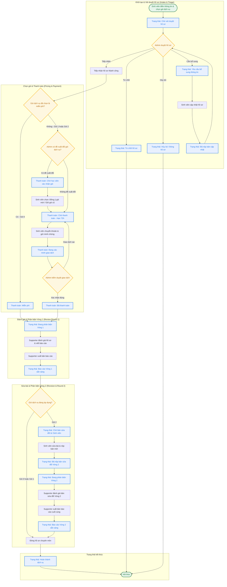

# Flow vòng đời case

- PRD reference: [`../prd/core-product-prd.md`](../prd/core-product-prd.md)
- Related requirements:
  - [`../requirements/case-workspace-and-status.md`](../requirements/case-workspace-and-status.md)
  - [`../requirements/revision-rounds-and-history.md`](../requirements/revision-rounds-and-history.md)
- Trạng thái: đang làm việc
## Mục tiêu

Cho user, admin, và supporter một mô hình nhất quán để biết case đang ở đâu, report nào đang có hiệu lực, và round hiện tại của case là gì.

## Sơ đồ Quy trình (Flowchart)

## Quyết định UX phase 1

- Case workspace là source of truth cho tài liệu, report, và lịch sử các vòng.
- User nhìn thấy `bản nhóm gửi`, `report vòng 1`, `bản sửa vòng 2` thay vì naming kỹ thuật nội bộ.
- Internal system vẫn giữ logic `version`, `assessment`, và `artifact` để không mất lịch sử.

## Vòng đời chính

1. User submit case.
2. Admin triage case.
3. Case được accept và assign supporter.
4. Supporter đọc tài liệu.
5. Nếu thiếu, supporter hoặc admin yêu cầu bổ sung.
6. Nếu đủ, supporter audit và publish report.
7. User xem report trong case workspace.
8. Nếu cần vòng tiếp theo, user gửi bản sửa mới.
9. Hệ thống tạo round mới trong cùng case.
10. Supporter review round mới và publish report mới.
11. Case hoàn tất khi gói hỗ trợ đã xong hoặc được đóng có chủ đích.

## Trạng thái và Nhãn Hiển thị (Finalized Status Mapping)

Hệ thống phân tách rõ ràng thành 3 chiều trạng thái độc lập để phục vụ các vai trò và ngữ cảnh khác nhau:

### 1. Trạng thái chuyên môn hiển thị cho Học viên (`user_facing_stage` / `studentStatusMap`)
Được dùng để định vị bước hiện tại trên Case Stepper:
- `submitted`: "Chờ xét duyệt"
- `triage_accepted`: "Đã tiếp nhận"
- `need_more_information`: "Cần bổ sung thông tin"
- `under_review`: "Đang phản biện"
- `report_ready`: "Báo cáo phản biện sẵn sàng"
- `waiting_for_revision`: "Chờ bản sửa từ nhóm"
- `revision_submitted`: "Đã nộp bản sửa"
- `completed`: "Hoàn thành"
- `rejected`: "Bị từ chối"
- `closed`: "Hoàn tất — Đã đóng"

### 2. Trạng thái nghiệp vụ nội bộ (`internal_status` / `supporterStatusMap`)
Chỉ hiển thị trong màn hình của Admin và Supporter để theo dõi tiến độ công việc:
- `triage_pending`: "Chờ duyệt"
- `accepted_unassigned`: "Chờ phân công Supporter"
- `assigned`: "Đã phân công"
- `waiting_user`: "Chờ phản hồi từ học viên"
- `supporter_working`: "Supporter đang xử lý"
- `report_ready_to_publish`: "Báo cáo chờ gửi"
- `done`: "Hoàn thành"
- `cancelled`: "Đã hủy"

### 3. Trạng thái thanh toán (`payment_status` / `paymentStatusMap`)
Được quản lý song song để hiển thị cảnh báo tài chính độc lập:
- `unpaid` / `pending`: "Chưa thanh toán" / "Chờ thanh toán"
- `awaiting_confirmation`: "Chờ xác nhận gói dịch vụ"
- `proof_submitted`: "Đang xác minh thanh toán"
- `pending_verification` / `pendingVerification`: "Chờ duyệt thanh toán"
- `paid`: "Đã thanh toán"
- `rejected`: "Thanh toán bị từ chối"
- `expired`: "Hết hạn thanh toán"
- `refunded`: "Đã hoàn tiền"
- `not_required`: "Miễn phí"

## Artifact model trong case

Mỗi artifact cần tối thiểu:
- round số mấy
- loại tài liệu
- direction: `input / output / evidence`
- ai upload hoặc publish
- thời gian tạo
- visibility: `user / internal`
- mô tả vai trò của tài liệu
- trạng thái: `active / superseded / internal-only`

## Document board trong case workspace

### Các nhóm hiển thị cho user

- `Tài liệu nhóm đã gửi`
- `Report / phản hồi từ Nexus`
- `Bản sửa của nhóm`
- `Lịch sử các vòng`

### Mỗi item hiển thị

- tên dễ hiểu
- round badge
- trạng thái hiện tại
- mô tả ngắn vai trò của tài liệu
- nút `Xem` hoặc `Tải xuống`

## Quy tắc vòng đời tài liệu

- Bản mới từ nhóm tạo round hoặc version mới phù hợp.
- Feedback hoặc report mới không tự động xóa report cũ.
- Report mới nhất phải nổi bật là bản đang có hiệu lực.
- Tài liệu cũ được giữ làm lịch sử, không ghi đè.

## Luồng ngoại lệ

- Case thiếu dữ liệu: chuyển sang `need_more_information`.
- User không phản hồi sau khi được yêu cầu bổ sung: case có thể đóng với lý do rõ.
- Supporter thấy case không nên đi tiếp: có thể đề xuất đóng case với lý do rõ.

## Quy tắc UX

- User luôn thấy stage hiện tại và next action.
- Report final đang có hiệu lực phải nổi bật hơn report cũ.
- File list không được lấn át report và hướng sửa.
- Internal note và artifact nội bộ không lộ ra ngoài.

## Thiếu / chưa rõ

- Locked for phase 1: user-facing stage dung nhan de hieu thay vi ma ky thuat.
- Chưa khóa closed reasons taxonomy.
