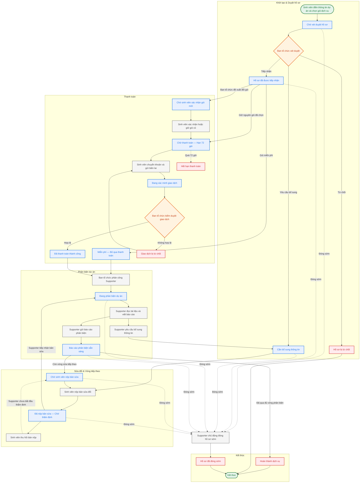

# Flow vòng đời case

- PRD reference: [`../prd/core-product-prd.md`](../prd/core-product-prd.md)
- Related requirements:
  - [`../requirements/case-workspace-and-status.md`](../requirements/case-workspace-and-status.md)
  - [`../requirements/revision-rounds-and-history.md`](../requirements/revision-rounds-and-history.md)
- Trạng thái: đã hoàn tất (đã đối chiếu mã nguồn 2026-07-07)

## Mục tiêu

Cho user, admin, và supporter một mô hình nhất quán để biết case đang ở đâu, report nào đang có hiệu lực, và round hiện tại của case là gì.

## Sơ đồ Quy trình (Flowchart)

Sơ đồ dưới đây thể hiện đầy đủ tương tác giữa 3 vai trò (Sinh viên, Admin, Supporter) và khớp 1:1 với bảng chuyển trạng thái `isValidStageTransition` trong mã nguồn.

## Bảng chuyển trạng thái (`isValidStageTransition`)

Bảng dưới đây là nguồn sự thật duy nhất, trích xuất từ [`case.types.ts`](../../apps/api/src/modules/cases/domain/case.types.ts):

| Từ trạng thái           | Chuyển được sang                                                                 |
| ----------------------- | -------------------------------------------------------------------------------- |
| `submitted`             | `triage_accepted`, `need_more_information`, `under_review`, `rejected`, `closed` |
| `triage_accepted`       | `under_review`, `closed`                                                         |
| `need_more_information` | `revision_submitted`, `closed`                                                   |
| `under_review`          | `report_ready`, `need_more_information`, `closed`                                |
| `report_ready`          | `waiting_for_revision`, `completed`, `closed`                                    |
| `waiting_for_revision`  | `revision_submitted`, `closed`                                                   |
| `revision_submitted`    | `under_review`, `need_more_information`, `closed`                                |

Trạng thái cuối (không chuyển đi được): `completed`, `rejected`, `closed`.

## Quyết định UX phase 1

- Case workspace là source of truth cho tài liệu, report, và lịch sử các vòng.
- User nhìn thấy `bản nhóm gửi`, `report vòng 1`, `bản sửa vòng 2` thay vì naming kỹ thuật nội bộ.
- Internal system vẫn giữ logic `version`, `assessment`, và `artifact` để không mất lịch sử.

## Vòng đời chính (đã đối chiếu code)

1. **Sinh viên** submit case → stage: `submitted`, internal: `triage_pending`, payment: `unpaid` (hoặc `not_required` nếu miễn phí).
2. **Admin** triage case:
   - Tiếp nhận → stage: `triage_accepted`, internal: `accepted_unassigned`.
   - Yêu cầu bổ sung → stage: `need_more_information`.
   - Từ chối → stage: `rejected`, internal: `cancelled`.
3. Khi tiếp nhận, payment flow bắt đầu:
   - Miễn phí → `not_required`, bỏ qua thanh toán.
   - Admin đề xuất gói khác → `awaiting_confirmation` → **Sinh viên** xác nhận → `pending` (72h).
   - Không đổi gói → `pending` (72h) trực tiếp.
4. **Sinh viên** chuyển khoản & gửi minh chứng → `proof_submitted`.
5. **Admin** kiểm duyệt giao dịch → `paid` hoặc `rejected`.
6. Khi payment satisfied (paid/not_required), **Admin** phân công Supporter → internal: `assigned`.
7. **Supporter** đọc tài liệu, viết báo cáo, hoặc yêu cầu bổ sung → stage: `under_review` hoặc `need_more_information`.
8. **Supporter** phê duyệt & gửi báo cáo → stage: `report_ready`.
9. Nếu gói có vòng sửa tiếp theo → stage: `waiting_for_revision`.
10. **Sinh viên** nộp bản sửa → stage: `revision_submitted`.
11. Quay lại bước 7 cho vòng tiếp theo (N vòng, không giới hạn cứng).
12. Khi hoàn tất → stage: `completed` hoặc supporter đóng case → stage: `closed`.

## Trạng thái và Nhãn Hiển thị (Finalized Status Mapping)

Hệ thống phân tách rõ ràng thành 3 chiều trạng thái độc lập để phục vụ các vai trò và ngữ cảnh khác nhau:

### 1. Trạng thái chuyên môn hiển thị cho Học viên (`user_facing_stage` / `studentStatusMap`)

Được dùng để định vị bước hiện tại trên Case Stepper:

- `submitted`: "Chờ xét duyệt"
- `triage_accepted`: "Đã tiếp nhận"
- `need_more_information`: "Cần bổ sung thông tin"
- `under_review`: "Đang phản biện"
- `report_ready`: "Báo cáo phản biện sẵn sàng"
- `waiting_for_revision`: "Chờ bản sửa từ nhóm"
- `revision_submitted`: "Đã nộp bản sửa"
- `completed`: "Hoàn thành"
- `rejected`: "Bị từ chối"
- `closed`: "Hoàn tất — Đã đóng"

### 2. Trạng thái nghiệp vụ nội bộ (`internal_status` / `supporterStatusMap`)

Chỉ hiển thị trong màn hình của Admin và Supporter để theo dõi tiến độ công việc:

- `triage_pending`: "Chờ duyệt"
- `accepted_unassigned`: "Chờ phân công Supporter"
- `assigned`: "Đã phân công"
- `waiting_user`: "Chờ phản hồi từ học viên"
- `supporter_working`: "Supporter đang xử lý"
- `report_ready_to_publish`: "Báo cáo chờ gửi"
- `done`: "Hoàn thành"
- `cancelled`: "Đã hủy"

### 3. Trạng thái thanh toán (`payment_status` / `paymentStatusMap`)

Được quản lý song song để hiển thị cảnh báo tài chính độc lập:

- `unpaid`: "Chưa thanh toán" (trạng thái khởi tạo)
- `not_required`: "Miễn phí"
- `awaiting_confirmation`: "Chờ xác nhận gói dịch vụ"
- `pending`: "Chờ thanh toán" (72h window)
- `proof_submitted`: "Đang xác minh thanh toán"
- `paid`: "Đã thanh toán"
- `rejected`: "Thanh toán bị từ chối"
- `expired`: "Hết hạn thanh toán"
- `refunded`: "Đã hoàn tiền"

## Ma trận vai trò – hành động

| Hành động                    | Sinh viên | Admin | Supporter |
| ---------------------------- | :-------: | :---: | :-------: |
| Tạo case & nộp hồ sơ         |    ✅     |       |           |
| Xét duyệt / từ chối hồ sơ    |           |  ✅   |           |
| Yêu cầu bổ sung thông tin    |           |  ✅   |    ✅     |
| Xác nhận gói dịch vụ đề xuất |    ✅     |       |           |
| Gửi minh chứng thanh toán    |    ✅     |       |           |
| Kiểm duyệt giao dịch         |           |  ✅   |           |
| Phân công Supporter          |           |  ✅   |           |
| Đọc tài liệu & viết báo cáo  |           |       |    ✅     |
| Phê duyệt & gửi báo cáo      |           |       |    ✅     |
| Nộp bản sửa đổi (revision)   |    ✅     |       |           |
| Thu hồi bản sửa đổi          |    ✅     |       |           |
| Tải output hỗ trợ            |           |       |    ✅     |
| Đóng case chuyên môn         |           |       |    ✅     |

## Artifact model trong case

Mỗi artifact cần tối thiểu:

- round số mấy
- loại tài liệu
- direction: `input / output / evidence`
- ai upload hoặc publish
- thời gian tạo
- visibility: `user / internal`
- mô tả vai trò của tài liệu
- trạng thái: `active / superseded / internal-only`

## Document board trong case workspace

### Các nhóm hiển thị cho user

- `Tài liệu nhóm đã gửi`
- `Report / phản hồi từ Nexus`
- `Bản sửa của nhóm`
- `Lịch sử các vòng`

### Mỗi item hiển thị

- tên dễ hiểu
- round badge
- trạng thái hiện tại
- mô tả ngắn vai trò của tài liệu
- nút `Xem` hoặc `Tải xuống`

## Quy tắc vòng đời tài liệu

- Bản mới từ nhóm tạo round hoặc version mới phù hợp.
- Feedback hoặc report mới không tự động xóa report cũ.
- Report mới nhất phải nổi bật là bản đang có hiệu lực.
- Tài liệu cũ được giữ làm lịch sử, không ghi đè.

## Luồng ngoại lệ

- Case thiếu dữ liệu: chuyển sang `need_more_information` (có thể từ cả admin lẫn supporter).
- User không phản hồi sau khi được yêu cầu bổ sung: case có thể đóng (`closed`) với lý do rõ.
- Supporter thấy case không nên đi tiếp: có thể đóng case (`closed`) với lý do rõ (yêu cầu tải tối thiểu output trước khi đóng).
- Thanh toán hết hạn 72h: `payment_status = expired`. Có thể kích hoạt lại trong 7 ngày.
- Thu hồi bản sửa: Sinh viên thu hồi revision nếu supporter chưa bắt đầu thẩm định (chưa có report liên kết).

## Quy tắc UX

- User luôn thấy stage hiện tại và next action.
- Report final đang có hiệu lực phải nổi bật hơn report cũ.
- File list không được lấn át report và hướng sửa.
- Internal note và artifact nội bộ không lộ ra ngoài.

## Thiếu / chưa rõ

- Locked for phase 1: user-facing stage dung nhan de hieu thay vi ma ky thuat.
- Chưa khóa closed reasons taxonomy.
