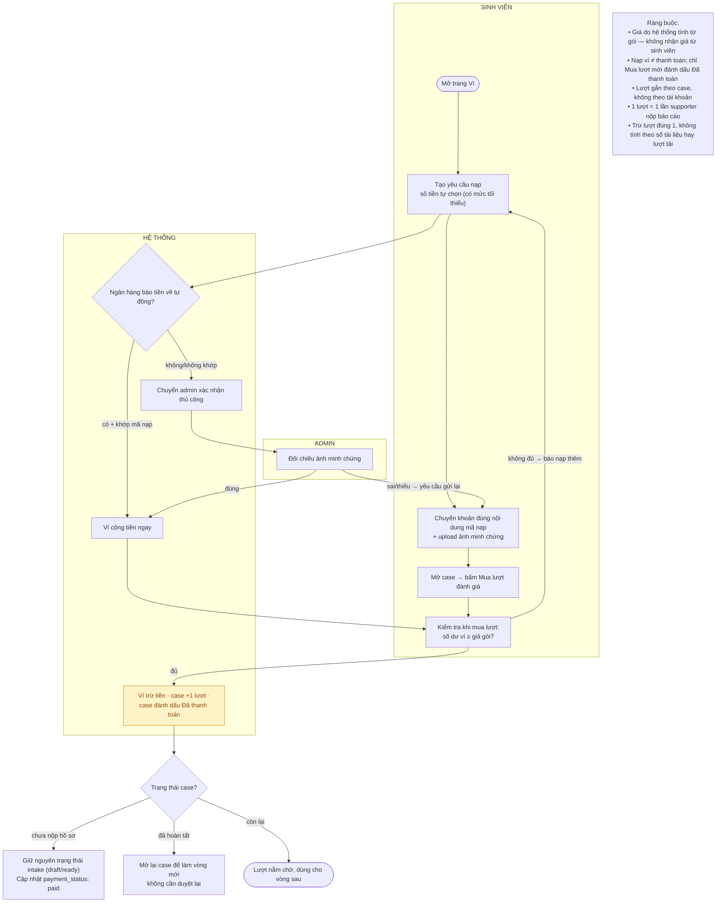

# Flow thanh toán & mua lượt đánh giá

- PRD reference: [`../prd/core-product-prd.md`](../prd/core-product-prd.md)
- Trạng thái: đang làm việc
- Ghi chú: file này thay thế nội dung "Payment Verification (deferred)" cũ — flow thanh toán thực tế đã được triển khai trong code và là một phần của luồng chính.

## Mục tiêu

Sinh viên nạp tiền vào ví, mua lượt đánh giá cho case, và case được đánh dấu `Đã thanh toán` — điều kiện bắt buộc để admin duyệt hồ sơ.

## Khái niệm

- **Ví**: nơi chứa số dư tiền thật của sinh viên (VND).
- **Lượt đánh giá**: mỗi lượt tương ứng với một lần supporter phân tích và nộp báo cáo. Lượt được mua theo case, không phải theo tài khoản.
- **Trạng thái thanh toán của case**:
  - `Chưa thanh toán` — case cần trả phí nhưng sinh viên chưa mua lượt.
  - `Đã thanh toán` — sinh viên đã mua ít nhất một lượt đánh giá cho case.
  - `Miễn thanh toán` — gói miễn phí, không cần mua lượt.

## Nguyên tắc

1. "Đã thanh toán" có nghĩa là **đã mua lượt đánh giá cho case đó** — không có bước thanh toán gói riêng biệt.
2. Giá lượt đánh giá do hệ thống tính từ gói dịch vụ (hiện tại 39.000đ/lượt, gói chuyên sâu). Sinh viên không tự đặt được giá.
3. Nạp tiền vào ví không làm case "Đã thanh toán". Chỉ hành động mua lượt mới đánh dấu thanh toán.
4. Mua lượt **không** đổi trạng thái hồ sơ (ngoại lệ: case đã hoàn tất thì mua lượt = mở lại case, xem flow vòng đời).
5. Mỗi lần supporter nộp báo cáo, hệ thống trừ 1 lượt. Sinh viên gửi bản sửa thì **không** bị trừ lượt.
6. **Case thuộc gói miễn phí (`pkg_tf_free` / `locked_price = 0`):** Giá lượt đánh giá tự động lấy theo gói chuyên sâu (`pkg_tf_audit`). Chỉ sau khi trừ ví VND thành công trong giao dịch mua lượt, case mới được tự động nâng cấp sang `pkg_tf_audit`, khóa giá (`locked_price = unitPrice`), đánh dấu `Đã thanh toán` (`payment_status: paid`) và ghi nhận event `package_upgraded`. Frontend không gọi nâng cấp trước (không pre-upgrade); nếu ví không đủ số dư, case vẫn giữ nguyên trạng thái miễn phí và banner không bị chuyển sang Chưa thanh toán.

## Click học viên (rút ngắn 2026-09)

- Đủ ví: Mua credit trên hồ sơ → trừ ví + cộng lượt. Không QR.
- Thiếu ví từ hồ sơ: mở QR nạp ổ thiếu. Không bắt qua trang ví.
- Còn trang QR: SePay hoặc admin verified → hệ thống mua lượt cho hồ sơ vừa chọn.
- Rời QR / vào Ví của tôi: chỉ cộng VND. Học viên bấm Mua credit lại khi đủ ví.
- Nạp từ trang ví: không gắn hồ sơ, không tự mua lượt.

## Sơ đồ luồng

## Luồng ngoại lệ

- **Chuyển khoản sai nội dung**: ngân hàng không khớp mã → admin kiểm tra thủ công qua ảnh minh chứng.
- **Nạp tiền nhưng chưa mua lượt**: case vẫn `Chưa thanh toán` — tiền nằm trong ví, sinh viên mua lượt bất kỳ lúc nào.
- **Hết lượt giữa chừng**: supporter không nộp được báo cáo; hệ thống báo sinh viên mua thêm lượt.
- **Case kết thúc không trọn vẹn** (từ chối/veto/hủy/xóa): lượt chưa dùng được hoàn về ví theo giá đã mua.

## Thiếu / chưa rõ

- Chưa có hoàn tiền khi sinh viên muốn rút tiền khỏi ví (chỉ hoàn tự động khi case kết thúc không trọn vẹn).
- ~~Chưa khóa chính sách giá cho gói miễn phí nếu mở rộng thêm gói mới.~~ ✅ Đã chuẩn hóa: case gói miễn phí (`pkg_tf_free`) khi mua lượt đánh giá được hệ thống resolve theo giá gói chuyên sâu (`pkg_tf_audit`) và nâng cấp tự động sau khi trừ ví thành công.
