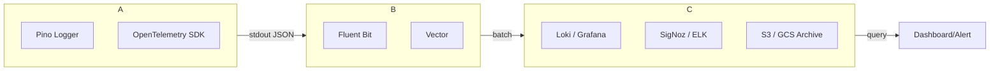
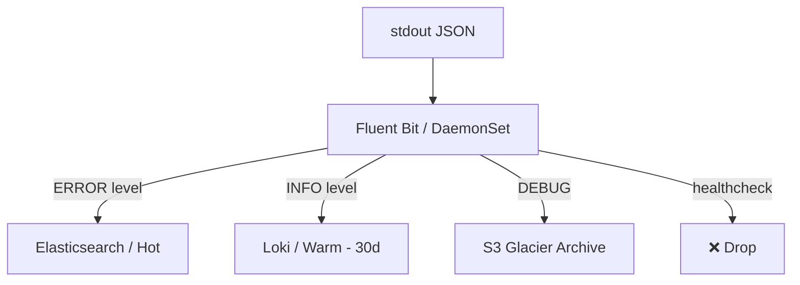

# Research Report: Modern Production Logging Best Practices 2026

**Date:** 2026-07-24
**Research by:** Sisyphus

---

## Executive Summary

Logging vào database (PostgreSQL/MySQL) là anti-pattern trong production. DB sinh ra cho transactional data, không phải append-only high-volume log streams. Hậu quả: write amplification, connection pool exhaustion, table bloat, backup bloat, query degradation khi log table lớn.

Modern logging stack: **structured JSON logs → stdout → log shipper → centralized log store → query/alert**.

Kiến trúc chuẩn 2026:
- **Logger**: Pino (Node.js) — structured JSON, 5-10x nhanh hơn Winston
- **Shipping**: stdout → Fluent Bit / Vector → object storage
- **Storage/Aggregation**: Grafana Loki (cost-effective, K8s-native) hoặc SigNoz (OTel-native, ClickHouse-backed)
- **Correlation**: OpenTelemetry — trace_id trong mọi log line
- **Cost control**: retention tiers, sampling, drop low-value logs

---

## 1. Tại Sao Log Vào Database Là Sai

### 1.1 Performance Impact

| Vấn đề | Giải thích |
|--------|-----------|
| Write amplification | Mỗi INSERT log gây index update, MVCC dead tuples, autovacuum |
| Connection pool nghẽn | Logger threads chiếm hết connections, request chính thiếu |
| Cache pollution | Log table đẩy data quan trọng ra khỏi buffer cache |
| Lock contention | Parallel writes tranh lock cùng table |

**Kinh nghiệm thực tế:**
- Một team ghi telemetry vào Postgres: connection pool saturated, không migrate được — phải kill connections thủ công lúc 3am
- TYPO3 sys_log 15GB full disk — MySQL không trả disk space
- Pydantic Logfire: trigger audit log làm migration 2s -> timeout vì ghi log mỗi row

### 1.2 Storage Cost

- DB storage: $0.10-0.30/GB/month (SSD)
- Object storage: $0.023/GB/month (S3) -> ~10-25x rẻ hơn
- Logs append-only, không cần ACID, không cần random read

### 1.3 Operational Issues

- Backup bloat: backup log table mỗi ngày => backup lớn gấp 10x data thật
- VACUUM/compaction không theo kịp write rate
- Table bloat không recover (MySQL không trả disk)
- Index fragmentation

### 1.4 Khi Nào DB Logging Có Thể Chấp Nhận?

- Audit logs cho compliance (cần ACID, immutable) — nhưng để DB riêng, không chung với transactional DB
- Low volume (< 100 req/s) và dev/staging
- Dùng COPY protocol, batch insert, không individual INSERT

---

## 2. Modern Logging Architecture



### 2.1 Application Layer

**Structured JSON logging** — non-negotiable:

```json
{
  "ts": "2026-07-24T10:00:00.000Z",
  "level": "info",
  "service": "api-gateway",
  "env": "production",
  "event": "request.completed",
  "trace_id": "4bf92f3577b34da6a3ce929d0e0e4736",
  "request_id": "req_abc123",
  "user_id": "usr_456",
  "method": "POST",
  "path": "/api/ideas",
  "status": 201,
  "duration_ms": 142,
  "message": "Idea created successfully"
}
```

### 2.2 Collection Layer

| Tool | RAM | Use Case |
|------|-----|----------|
| Fluent Bit | ~10MB | Node-level shipping, first-pass filter |
| Vector | ~50MB | Complex routing, transformation |
| Promtail | ~20MB | Loki-native shipping |

### 2.3 Storage & Query Layer

| Platform | Index Strategy | Storage Cost | Query Speed | Best For |
|----------|---------------|-------------|-------------|----------|
| **Grafana Loki** | Label-only | $ (S3) | Fast after label filter | Cost-effective, K8s-native |
| **SigNoz** | Full + columnar (ClickHouse) | $$ | Fast aggregations | OTel-native unified observability |
| **ELK Stack** | Full-text inverted index | $$$ (SSD) | Fastest arbitrary search | Security/SIEM, complex analytics |
| **Datadog** | Full-text | $$$$$ | Fast | Teams with budget, unified platform |

---

## 3. Node.js/TypeScript Logger: Pino vs Winston

### 3.1 Benchmark

| Metric | Pino 9.x | Winston 3.14+ |
|--------|----------|---------------|
| Throughput | ~95,000 events/s | ~14,000 events/s |
| Bundle size | ~25 KB min | ~200 KB |
| Async by default | ✅ (worker thread) | ❌ (sync pipe) |
| Built-in redaction | ✅ wildcards | ❌ (custom format) |
| Worker-thread transport | ✅ native | ❌ manual |
| Default logger của | Fastify, Hono, NestJS-Fastify | None |

### 3.2 Production Setup với Pino

```typescript
import pino from 'pino';

const logger = pino({
  level: process.env.LOG_LEVEL ?? 'info',
  transport: process.env.NODE_ENV !== 'production'
    ? { target: 'pino-pretty', options: { colorize: true } }
    : undefined,
  base: {
    service: process.env.SERVICE_NAME ?? 'nexus-api',
    env: process.env.NODE_ENV ?? 'development',
  },
  redact: {
    paths: [
      'req.headers.authorization',
      'req.headers.cookie',
      '*.password',
      '*.token',
      '*.secret',
    ],
    censor: '[REDACTED]',
  },
  timestamp: pino.stdTimeFunctions.isoTime,
});
```

### 3.3 Request-scoped Logger với AsyncLocalStorage

```typescript
import { AsyncLocalStorage } from 'node:async_hooks';
import { randomUUID } from 'node:crypto';

const als = new AsyncLocalStorage<{ requestId: string; traceId: string }>();

// Middleware: gán correlation ID mỗi request
app.use('*', (c, next) => {
  const requestId = c.req.header('x-request-id') ?? randomUUID();
  const traceId = c.req.header('traceparent') ?? randomUUID();
  return als.run({ requestId, traceId }, () => next());
});

// Helper: lấy logger với context
function getLogger() {
  const ctx = als.getStore();
  return ctx ? logger.child(ctx) : logger;
}
```

### 3.4 Runtime Log Level (không restart)

```typescript
app.put('/admin/log-level', async (c) => {
  const { level } = await c.req.json<{ level: string }>();
  const valid = ['fatal', 'error', 'warn', 'info', 'debug', 'trace'];
  if (!valid.includes(level)) return c.json({ error: 'Invalid level' }, 400);
  
  logger.level = level;
  logger.info({ newLevel: level }, 'log level changed at runtime');
  return c.json({ level });
});
```

---

## 4. Log Levels Strategy

| Level | When | Alert? | Volume |
|-------|------|--------|--------|
| `fatal` | Process crash imminent | Page immediately | Rất thấp |
| `error` | Operation failed, user affected | Alert within 5 min | Thấp |
| `warn` | Retry succeeded, degraded state | Dashboard only | Trung bình |
| `info` | Business event (request completed) | Never | Cao (điều chỉnh) |
| `debug` | Internal state, query plans | Never, off in prod | Rất cao |
| `trace` | Per-iteration data | Never, off in prod | Cực cao |

**Rule:**
- Production mặc định `LOG_LEVEL=info`
- `debug` tắt trong production. Bật khi đang investigate incident qua endpoint
- Mỗi request chỉ 1-2 `info` lines, không 15+

---

## 5. OpenTelemetry Log Correlation

OTel là industry standard cho log-traces-metrics correlation:

```
log → trace_id, span_id tự động gắn → query unified
```

**Setup cơ bản:**
1. OTel SDK inject trace context vào log tự động
2. Log ship qua OTLP endpoint (Collector)
3. Backend (SigNoz, Grafana Tempo+Loki) correlation tự động

---

## 6. Log Routing & Cost Control



**Filter trước khi ship:**
- Drop healthcheck, readiness probe logs (20-30% volume)
- Drop 2xx Envoy access logs
- Sample DEBUG 10%
- Batch progress logs: summary line ở cuối job

---

## 7. Storage Tiers (Retention)

| Tier | Duration | Storage | Cost/GB/month | Query Speed |
|------|----------|---------|---------------|-------------|
| Hot | 0-7 days | Local SSD | $0.10 | Sub-second |
| Warm | 7-30 days | S3 Standard | $0.023 | Seconds |
| Cold | 1-12 months | S3 Glacier | $0.004 | Minutes (restore) |
| Archive | >1 year | S3 Deep Archive | $0.001 | Hours |

---

## 8. Common Pitfalls

1. **console.log trong production** → mất structured fields, không query được
2. **DEBUG log trong production** → cost tăng vọt, noise signal
3. **Log PII** (email, password, token) → compliance violation, dùng `redact`
4. **Không có trace_id** → không trace được request qua services
5. **Log cả request body** → security risk, cost cao
6. **Sync logging** → block event loop (Winston default)

---

## 9. Recommendations for Nexus Platform

| Component | Recommendation | Lý do |
|-----------|---------------|-------|
| Logger | **Pino** | Hono-native, worker-thread, 5x nhanh Winston |
| Log format | JSON stdout | Exportable, queryable |
| Correlation | AsyncLocalStorage + trace_id | Debug multi-service |
| Aggregation | **SigNoz** (self-hosted) hoặc Grafana Loki | OTel-native, ClickHouse, rẻ |
| DB logging | **Không dùng** | Query interference, table bloat |
| Audit log cần DB | DB riêng, batch insert | Không chung transactional DB |
| Secrecy | Pino `redact` paths | Block PII, token trước khi ra khỏi process |

---

## Resources & References

- [PostHog Logging Best Practices](https://posthog.com/docs/logs/best-practices)
- [Honeycomb Engineer's Checklist](https://www.honeycomb.io/blog/engineers-checklist-logging-best-practices)
- [Pino vs Winston 2026 Comparison](https://betterstack.com/community/guides/scaling-nodejs/pino-vs-winston/)
- [SigNoz vs Datadog vs Grafana 2026](https://apiscout.dev/guides/datadog-vs-signoz-vs-grafana-vs-openobserve-2026)
- [K8s Logging: Loki vs ELK](https://ncluster.tech/blog/kubernetes-logging-loki-elk/)
- [Why DB logging is bad](https://medium.com/sitewards/why-logging-to-mysql-database-is-an-antipatern-afe1c1b48222)
- [OpenTelemetry Logging Spec](https://opentelemetry.io/docs/specs/otel/logs/)
- [Log Management at Scale](https://zakhassan.com/blog/log-management-at-scale-structured-logging-routing-and-cost-control)

---

## Unresolved Questions

1. Pino sync mode cho audit logs compliance? Trade-off: mất async benefit nhưng guarantee ghi
2. Có nên dùng OpenObserve thay Loki cho storage cost tối ưu? Cần benchmark thêm
3. Logging cost ở volume < 100GB/tháng: SigNoz self-hosted vs Grafana Cloud free tier?
