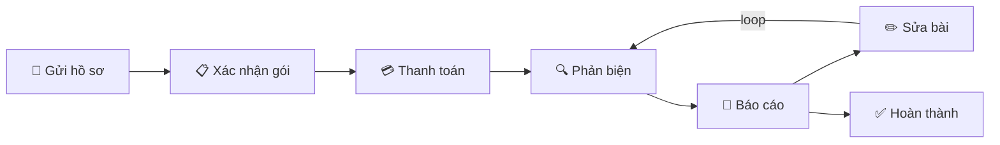

# Brainstorm: Status & Timeline Redesign

## 1. Vấn đề hiện tại

### 1A. CaseCard hiển thị 2 badge song song — gây rối

**Hiện trạng**: [CaseCard.tsx](../../apps/web-1/app/dashboard/_components/CaseCard.tsx#L50-L57)

```
[Hồ sơ đã gửi — chờ xét duyệt]  [Chưa thanh toán]
```

- 2 `<Badge>` cùng `size="sm"`, `variant="light"`, `text-[10px]`
- Cùng weight visual, không label prefix
- Có case cả 2 badge cùng màu vàng (VD: `need_more_information` + `pending`)
- User không biết cái nào là "tiến trình case" vs "thanh toán"

### 1B. Không có progress stepper cho lifecycle

- **ActivityTimeline** chỉ là log sự kiện (quá khứ → hiện tại), không phải roadmap (hiện tại → tương lai)
- [CaseStatusHeader](../../apps/web-1/app/dashboard/case/%5Bid%5D/_components/CaseStatusHeader.tsx) chỉ show 1 badge + SLA timer
- Code đã reference `intake`, `payment`, `checkpoint_1-3` trong `getStageLabel()` (L84-99) nhưng **chưa dùng** cho stepper UI nào
- User vào case workspace: không biết mình đang ở đâu, còn bao nhiêu bước

### 1C. statusThemeMap gộp chung 3 chiều status

[statusThemeMap](../../apps/web-1/types/case.ts#L196-L330) — 29 entry trộn lẫn `user_facing_stage` + `internal_status` + `payment_status` vào 1 flat map. Khó maintain, dễ conflict key.

### 1D. DB schema đã tách 3 field nhưng UX chưa phản ánh đúng

```
Case {
  user_facing_stage   → 10 values (student nhìn thấy)
  internal_status     → 8 values (admin/supporter nhìn thấy)  
  payment_status      → 9 values (cả hai nhìn thấy, nhưng context khác)
}
```

Tách DB: ✅ hợp lý. Vấn đề ở **presentation layer**.

---

## 2. Gợi ý gốc từ note

| # | Gợi ý | Phân tích |
|---|-------|-----------|
| 1 | Dùng chung status cho user/supporter → tách | DB đã tách (`user_facing_stage` vs `internal_status`). Vấn đề thật: `statusThemeMap` gộp chung + CaseCard hiện cả 2 |
| 2 | Thêm timeline user biết đang ở giai đoạn nào | Cần **progress stepper** (forward-looking), không phải event timeline (backward-looking) |
| 3 | Vào phát biết luôn, dùng màu sắc + timeline | Visual-first status, stepper + color-coded stages |
| 4 | 2 status kế nhau → gom 1, thanh toán xong mới nhảy stage | Payment = **gate**, không phải track song song |

---

## 3. Phân tích 3 hướng tiếp cận

### Approach A: Unified Linear Pipeline (Payment as Gate)



**Ý tưởng**: Gom `payment_status` vào pipeline chính. CaseCard chỉ show 1 badge = bước hiện tại trong pipeline.

**Logic gom**:
```
Pipeline step = f(user_facing_stage, payment_status)

submitted                        → "Chờ xét duyệt"
triage_accepted + awaiting_conf  → "Xác nhận gói"
triage_accepted + pending        → "Chờ thanh toán"
triage_accepted + proof_submitted→ "Đang xác minh thanh toán"
under_review                     → "Đang phản biện"
report_ready                     → "Báo cáo sẵn sàng"
waiting_for_revision             → "Chờ bản sửa"
revision_submitted               → "Đã nộp sửa"
completed/closed                 → "Hoàn thành"
```

| Pro | Con |
|-----|-----|
| 1 badge duy nhất, user không bị rối | Cần function compute `pipelineStep` |
| Mental model tuyến tính, dễ hiểu | Payment sub-states phải flatten vào pipeline |
| CaseCard nhẹ nhàng hơn | Mất flexibility nếu sau này payment track tách riêng |
| Phù hợp note: "thanh toán rồi mới nhảy stage" | Revision loop phải handle đặc biệt |

### Approach B: Keep Schema, Single Computed Badge

**Ý tưởng**: Giữ nguyên 3 field DB. Tạo `getDisplayStatus(stage, payment, internal)` trả về 1 badge duy nhất.

**Priority rule**:
```
if (payment_status is blocking)  → show payment status
if (need_more_information)       → show "Cần bổ sung"
else                             → show user_facing_stage
```

| Pro | Con |
|-----|-----|
| Không đổi schema | Logic priority phức tạp, edge case nhiều |
| Backward compatible | Khi cả 2 đều "quan trọng" → chọn cái nào? |
| Deploy nhanh | Vẫn không có stepper/timeline |

### Approach C: Pipeline Stepper + Single Active Badge ⭐

**Ý tưởng**: Kết hợp Approach A + thêm visual stepper.

**CaseCard**: 1 computed badge (pipeline step)
**Case Workspace**: Stepper bar ở header showing toàn bộ journey

```
 ┌─────────────────────────────────────────────────────────────┐
 │  ● ──── ● ──── ◉ ──── ○ ──── ○ ──── ○                     │
 │ Gửi   Xác nhận Thanh  Phản   Báo    Hoàn                  │
 │ hồ sơ  gói     toán   biện   cáo    thành                  │
 │              ▲ current                                      │
 └─────────────────────────────────────────────────────────────┘
```

**Stepper states**:
- `●` completed (teal/green, checkmark)
- `◉` current (brand color, pulse dot)
- `○` upcoming (muted gray)
- `✕` rejected/cancelled (red, strike-through)

| Pro | Con |
|-----|-----|
| User vào phát biết luôn mình ở đâu | Frontend work nhiều hơn |
| Có roadmap forward-looking | Cần define rõ pipeline stages |
| 1 badge + stepper = đầy đủ context | Revision loop cần visual đặc biệt |
| Phù hợp tất cả gợi ý trong note | Stepper responsive trên mobile |
| Tận dụng được code `getStageLabel()` đã có | — |

---

## 4. Đề xuất: Approach C

### 4.1 Pipeline Stages (proposed)

```typescript
const PIPELINE_STAGES = [
  { key: 'intake',     label: 'Gửi hồ sơ',    icon: FileText },
  { key: 'confirm',    label: 'Xác nhận gói',  icon: Package },
  { key: 'payment',    label: 'Thanh toán',     icon: CreditCard },
  { key: 'review',     label: 'Phản biện',      icon: Search },
  { key: 'report',     label: 'Báo cáo',        icon: FileCheck },
  { key: 'revision',   label: 'Sửa bài',        icon: PenLine },  // optional step
  { key: 'done',       label: 'Hoàn thành',     icon: CheckCircle },
] as const;
```

### 4.2 Mapping function

```typescript
function getPipelineStep(
  stage: UserFacingStage,
  paymentStatus: PaymentStatus
): PipelineStepKey {
  // Terminal states
  if (['completed', 'closed'].includes(stage)) return 'done';
  if (stage === 'rejected') return 'rejected'; // special

  // Payment gate
  if (stage === 'submitted') return 'intake';
  
  if (['awaiting_confirmation'].includes(paymentStatus)) return 'confirm';
  
  if (['pending', 'proof_submitted', 'pending_verification'].includes(paymentStatus) 
      && !isPaymentSatisfied(paymentStatus)) return 'payment';

  // Post-payment stages
  if (stage === 'under_review') return 'review';
  if (stage === 'report_ready') return 'report';
  if (['waiting_for_revision', 'revision_submitted'].includes(stage)) return 'revision';
  if (stage === 'need_more_information') return 'review'; // still in review cycle

  return 'intake'; // fallback
}
```

### 4.3 CaseCard redesign

```
Before (confusing):
┌──────────────────────────────────────────────┐
│ Case #NX-001                                 │
│ [Hồ sơ đã gửi — chờ xét duyệt] [Chưa TT]  │  ← 2 badges, rối
│ Checkpoint: CP1-EVAL                         │
└──────────────────────────────────────────────┘

After (clear):
┌──────────────────────────────────────────────┐
│ Case #NX-001                                 │
│ ● ── ◉ ── ○ ── ○ ── ○                       │  ← mini stepper
│ [Chờ xét duyệt]                             │  ← 1 badge duy nhất
│ Checkpoint: CP1-EVAL                         │
└──────────────────────────────────────────────┘
```

Hoặc option nhẹ hơn (không stepper trên card):

```
After (minimal):
┌──────────────────────────────────────────────┐
│ Case #NX-001                                 │
│ ◉ Chờ xét duyệt                    2/6 ▸    │  ← 1 status + progress fraction
│ Checkpoint: CP1-EVAL                         │
└──────────────────────────────────────────────┘
```

### 4.4 Case Workspace header redesign

```
┌──────────────────────────────────────────────────────────────────┐
│  Case #NX-001 · Nhóm Alpha                                      │
│                                                                  │
│  ✓ ─── ✓ ─── ◉ ─── ○ ─── ○ ─── ○                               │
│  Gửi   Xác    Thanh  Phản  Báo   Hoàn                           │
│  hồ sơ nhận   toán   biện  cáo   thành                          │
│         gói   ▲ đang chờ xác minh                                │
│                                                                  │
│  ⏳ Hạn: 3 ngày 14 giờ                                          │
└──────────────────────────────────────────────────────────────────┘
```

### 4.5 statusThemeMap refactor

Tách 1 flat map → 3 typed maps:

```typescript
// Tách rõ 3 chiều
const stageThemeMap: Record<UserFacingStage, ThemeEntry> = { ... }
const paymentThemeMap: Record<PaymentStatus, ThemeEntry> = { ... }
const internalThemeMap: Record<InternalStatus, ThemeEntry> = { ... }

// Computed display (cho CaseCard / student-facing)
const pipelineThemeMap: Record<PipelineStepKey, ThemeEntry> = { ... }
```

### 4.6 Revision loop handling

Revision là bước **optional** và có thể **loop** (revision → review → report → revision...).

```
Lần 1: ✓ ── ✓ ── ✓ ── ◉ ── ○ ── ○
                       Phản biện

Lần 2: ✓ ── ✓ ── ✓ ── ✓ ── ✓ ── ◉ ── ○
                                 Sửa bài (lần 2)

Hoặc: collapse revision loop thành 1 step "Phản biện & sửa bài"
      với sub-indicator: "Vòng 2/3"
```

> [!IMPORTANT]
> Revision loop visualization cần quyết định: flatten thành 1 step có counter, hay expand thành multi-step. Recommend: **1 step + counter** (KISS).

---

## 5. Scope tác động

### Cần thay đổi

| Layer | File | Thay đổi |
|-------|------|----------|
| **Shared types** | `apps/web-1/types/case.ts` | Tách `statusThemeMap` → 3 maps + `pipelineThemeMap`, thêm `PipelineStepKey` type, thêm `getPipelineStep()` |
| **CaseCard** | `apps/web-1/app/dashboard/_components/CaseCard.tsx` | Bỏ 2 badge → 1 badge + optional mini stepper |
| **CaseStatusHeader** | `apps/web-1/app/dashboard/case/[id]/_components/CaseStatusHeader.tsx` | Thêm stepper bar, giữ SLA timer |
| **New component** | `CasePipelineStepper.tsx` | Component stepper mới, reusable cho card + workspace |
| **StatusGuidanceCard** | Giữ nguyên logic | Có thể integrate với stepper context |

### Không cần thay đổi

| Layer | Lý do |
|-------|-------|
| **DB schema** | 3 field đã đúng, chỉ đổi presentation |
| **Backend API** | Status transitions giữ nguyên |
| **Backend types** | `case.types.ts`, `payment.types.ts` giữ nguyên |
| **Admin/Supporter views** | Họ cần detail view, không cần simplified pipeline |
| **ActivityTimeline** | Vẫn hữu ích cho event log, tách biệt với progress stepper |

---

## 6. Quyết định đã chốt (Decisions)

1. **CaseCard**: Dùng 1 badge duy nhất + fraction progress (VD: "Chờ xét duyệt 2/6 ▸").
2. **Revision loop**: Gộp chung thành 1 bước trên stepper và gắn thêm bộ đếm (Ví dụ: "Sửa bài (Vòng 2)").
3. **`not_required` (miễn phí)**: Giữ bước "Thanh toán" nhưng đánh dấu "✓ Miễn phí" (màu xanh lá).
4. **Rejected case**: Đánh dấu [✕] đỏ tại bước bị Reject, làm mờ (gray out) các bước tương lai.
5. **Mobile responsive**: Thanh ngang thu gọn kiểu Breadcrumb (Ví dụ: "Bước 2/6 - Thanh toán"), bấm vào xổ ra danh sách chi tiết.
6. **Scope**: Triển khai đồng loạt cả CaseCard và Header cùng một lúc.
7. **Component UI**: Sử dụng component `Stepper` của Mantine UI cho timeline ngang (Workspace Header). Không tự code/draw từ đầu để đảm bảo đồng nhất hệ thống.

---

## 7. Risk & Trade-off

| Risk | Mitigation |
|------|------------|
| Mapping function `getPipelineStep` có edge case | Unit test cho tất cả combo `stage × payment` |
| Stepper trên CaseCard chiếm quá nhiều space | Option: chỉ dùng badge + fraction, stepper chỉ ở workspace |
| User quen 2 badge → confused khi đổi 1 | Transition period: show tooltip "Thanh toán: Đã TT" khi hover |
| Revision loop làm stepper confusing | Collapse thành 1 step + "Vòng X" counter |
| Admin/supporter cần payment detail | Giữ nguyên view riêng, không ảnh hưởng |
