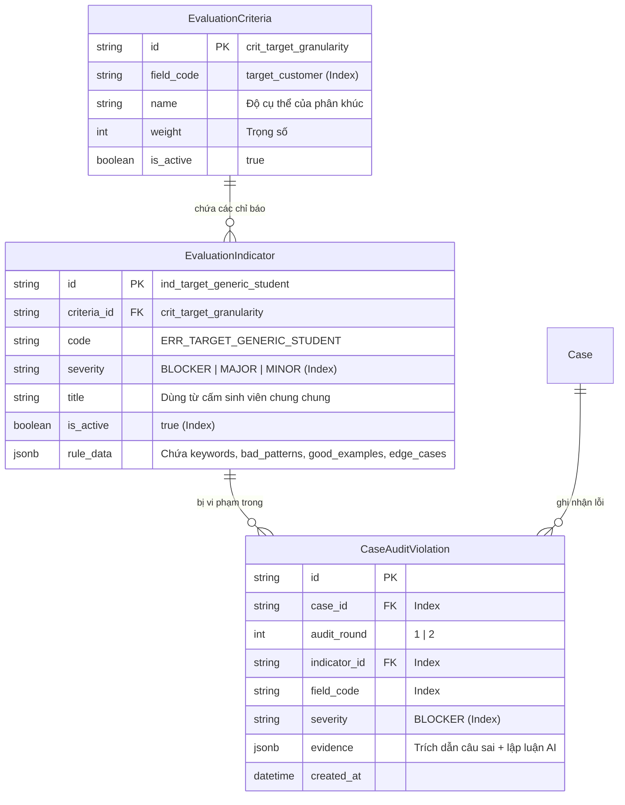

# BÁO CÁO BRAINSTORM TOÀN DIỆN: TÁI CẤU TRÚC GÓI DỊCH VỤ (79K/149K), LÕI ĐÁNH GIÁ (CORE ENGINE) & KIẾN TRÚC VÒNG ĐỜI TÀI LIỆU (DOCUMENT LIFECYCLE)

> **Tài liệu nguồn:** `temp/omp-session-2026-09-06-dialogue-clean.txt` (Phiên làm việc `01a07584-6ce3-702a-bbd2-1762647c03e3`)  
> **Thời điểm niêm phong:** 06/09/2026  
> **Người chủ trì brainstorm:** User (Product Owner / Tech Lead) & Solution Brainstormer Agent  
> **Trạng thái:** Đang đánh giá tính sẵn sàng lập kế hoạch (Plan Readiness Assessment) — Phát hiện 7 tử huyệt kiến trúc cần giải quyết trước khi lên Plan

---

## MỤC LỤC
1. [Bối cảnh lịch sử & Nguồn gốc thực tế của Nexus](#1-bối-cảnh-lịch-sử--nguồn-gốc-thực-tế-của-nexus)
2. [Hiện trạng kỹ thuật & Xử lý Pull Request #34](#2-hiện-trạng-kỹ-thuật--xử-lý-pull-request-34)
3. [Xung đột tư duy & Sự hợp nhất 3 thế hệ kiến trúc](#3-xung-đột-tư-duy--sự-hợp-nhất-3-thế-hệ-kiến-trúc)
4. [Tái cấu trúc trải nghiệm thanh toán (Payment UX) & Mô hình Credit](#4-tái-cấu-trúc-trải-nghiệm-thanh-toán-payment-ux--mô-hình-credit)
5. [Mổ xẻ "Cái lõi" đánh giá (The Core Engine) & Hệ tiêu chí](#5-mổ-xẻ-cái-lõi-đánh-giá-the-core-engine--hệ-tiêu-chí)
6. [Cơ chế chuyển đổi điểm số toán học (Deterministic Scoring) & Cứu hộ định dạng](#6-cơ-chế-chuyển-đổi-điểm-số-toán-học-deterministic-scoring--cứu-hộ-định-dạng)
7. [Kiến trúc Cơ sở dữ liệu động cho Agent: "Strong Spine, Flexible Ribs"](#7-kiến-trúc-cơ-sở-dữ-liệu-động-cho-agent-strong-spine-flexible-ribs)
8. [Tổng hợp Quyết định kiến trúc (ADR Summary) & Kế hoạch 4 giai đoạn](#8-tổng-hợp-quyết-định-kiến-trúc-adr-summary--kế-hoạch-4-giai-đoạn)
9. [Đánh giá tính sẵn sàng lập kế hoạch & 7 tử huyệt kiến trúc (Plan Readiness & Core Blockers)](#9-đánh-giá-tính-sẵn-sàng-lập-kế-hoạch--7-tử-huyệt-kiến-trúc-plan-readiness--core-blockers)
10. [Bảng đối chiếu Đã đủ vs. Còn thiếu & 3 Quyết định cốt lõi cho phiên tiếp theo](#10-bảng-đối-chiếu-đã-đủ-vs-còn-thiếu--3-quyết-định-cốt-lõi-cho-phiên-tiếp-theo)

---

## 1. BỐI CẢNH LỊCH SỬ & NGUỒN GỐC THỰC TẾ CỦA NEXUS

### 1.1. Thực tế từ 12 nhóm sinh viên tại `HƯỚNG DẪN CÁC NHÓM`
Trước khi có phần mềm web tự động, Nexus đã vận hành thực tế hỗ trợ **12 nhóm sinh viên FPT môn EXE101** (từ nhóm `0001_26` đến `0012_187` được lưu trữ tại `E:\FPT\Semester_7\EXE101\HƯỚNG DẪN CÁC NHÓM`).
- Toàn bộ dữ liệu thực chứng gồm:
  - Các bản nộp gốc của sinh viên: `_INPUT_SUBMISSION_ORIGINAL.md`
  - Các bản báo cáo thẩm định xuất bản: `_OUTPUT_FINAL_REPORT_DELIVERED.md`
  - Tài liệu đặc tả vòng đời tài liệu: `LIFECYCLE_IMPLEMENTATION_SPEC.md`
- Trong giai đoạn này, Product Owner đóng vai trò là "Human Operator":
  1. Nhận bài nộp sơ khởi qua tin nhắn riêng.
  2. Đưa bài nộp qua System Prompt được căn chỉnh thủ công trên ChatGPT.
  3. Xuất file báo cáo Markdown gửi lại cho sinh viên.
  4. Sinh viên đọc các lỗi vi phạm, chỉnh sửa bài làm và gửi lại bản cập nhật.
  5. Tiếp tục thẩm định lần 2, lần 3 cho đến khi bài đạt chuẩn Checkpoint 1.

### 1.2. Bản chất bất biến của Checkpoint 1: Vòng lặp sửa bài (Iteration Loop)
Từ dữ liệu thực tế của 12 nhóm, phát hiện một chân lý miền (Domain Insight) cốt tử:
* **Không có bất kỳ nhóm nào nộp bài 1 lần duy nhất mà đạt chuẩn ngay.**
* Bài nộp vòng 1 (`v01`) luôn mắc các lỗi ngây thơ kinh điển: Vấn đề quá rộng ("giải quyết nỗi buồn của giới trẻ"), Khách hàng mục tiêu mơ hồ ("tất cả sinh viên Việt Nam"), Giải pháp "búa tìm đinh" (đòi làm Siêu ứng dụng tích hợp AI/Blockchain mà chưa phỏng vấn được 1 khách hàng nào).
* Sau khi nhận Báo cáo thẩm định vòng 1, sinh viên **bắt buộc phải sửa bài và nộp lại vòng 2 (`v02`)** để đào sâu phân khúc hẹp và bổ sung số liệu chứng minh.
* Thực tế cho thấy: Số vòng lặp tối đa của một nhóm tại Checkpoint 1 là **3 lần (v01, v02, v03)**. Đến vòng 3, ý tưởng đã đủ độ sắc bén để tự tin pitching trước hội đồng giảng viên.

### 1.3. Hậu quả lên thiết kế mã nguồn ban đầu
- Vì nhận thấy sinh viên cần nộp bài nhiều lần cho 1 Checkpoint, kiến trúc ban đầu của Nexus đã thiết kế mô hình **Ví Credit theo Case** (sinh viên nạp credit để có lượt nộp bài lại).
- Tuy nhiên, khi đưa mô hình này lên giao diện thương mại sau buổi Demo Pitching, sự nhập nhằng giữa "mua credit trừ dần" và "mua gói dịch vụ 79k / 149k" đã tạo ra xung đột nghiêm trọng về trải nghiệm người dùng và logic State Machine.

---

## 2. HIỆN TRẠNG KỸ THUẬT & XỬ LÝ PULL REQUEST #34

### 2.1. Xác minh Cơ sở dữ liệu thực tế (Production Database)
- Đã thực hiện truy vấn trực tiếp vào bảng `service_packages` thông qua chuỗi kết nối an toàn `READONLY_DATABASE_URL`:
  - `pkg_ai_audit` (**79.000 VNĐ**): Đã tồn tại trong DB, `is_active = true`, `features` chứa mô tả gói tự động.
  - `pkg_supporter_audit` (**149.000 VNĐ**): Đã tồn tại trong DB, `is_active = true`, `features` chứa mô tả gói có Mentor thẩm định.
  - `pkg_tf_audit` (**39.000 VNĐ**): Gói cũ, đã bị vô hiệu hóa (`is_active = false`).
- **Kết luận:** Cơ sở dữ liệu thực tế **đã có sẵn 2 gói 79k và 149k**. Nhận định ban đầu của AI cho rằng "bảng ServicePackage chưa có 2 gói này" là sai sót do đọc tài liệu phân tích cũ chưa cập nhật.

### 2.2. Kiểm tra và Hợp nhất PR #34
- **PR #34 (`feat/payment-flow-shortcut-fix`)**:
  - Giải quyết bài toán: Sinh viên thanh toán mà ví thiếu tiền sẽ được chuyển hướng thẳng sang `/dashboard/payment?amount=...`, tự động tạo giao dịch VietQR với đúng số tiền còn thiếu.
  - Sau khi chuyển khoản qua SePay, Webhook cập nhật số dư ví tức thì và tự động hoàn tất đơn hàng.
- **Quyết định:** Đã hợp nhất (Merge) PR #34 vào nhánh `dev`, sau đó pull code mới nhất về nhánh làm việc `feat/pricing-package-tiers-ui`. Toàn bộ luồng thanh toán mới của 2 gói 79k/149k sẽ kế thừa 100% nền tảng vững chắc này.

---

## 3. XUNG ĐỘT TƯ DUY & SỰ HỢP NHẤT 3 THẾ HỆ KIẾN TRÚC

### 3.1. Ba thế hệ tư duy trong Nexus
1. **Thế hệ 1 (Mô hình Dịch vụ Tĩnh):** Gói bán theo số lượt đánh giá tĩnh (Gói 1 lượt, Gói 2 lượt, Gói vô hạn lượt). Phù hợp bán lẻ nhưng thiếu khả năng quản lý vòng đời tài liệu.
2. **Thế hệ 2 (Mô hình Ví Credit theo Case - Code hiện tại):** Nạp tiền vào ví  $\rightarrow$  Đổi thành Credit  $\rightarrow$  Mỗi lần nộp bài/yêu cầu báo cáo trừ 1 Credit. Linh hoạt về kỹ thuật nhưng giao diện cực kỳ khó hiểu đối với sinh viên.
3. **Thế hệ 3 (Mô hình Phân tầng Thương mại 79k/149k):** Sinh viên mua Cấp độ giải pháp (Gói 79k: Máy chấm AI tức thì; Gói 149k: Mentor người thật thẩm định chuyên sâu + 24h tư vấn).

### 3.2. Bản chất của sự xung đột
* **Xung đột 1 (Kỳ vọng người dùng vs Chi phí vận hành):** 
  - Gói 79k là **100% máy chấm**, chi phí 1 lần chạy API chỉ tốn 1.000đ – 2.000đ. Máy không biết mệt, do đó việc cho phép sinh viên nộp bài sửa lại lần 2 miễn phí trong 24 giờ là hoàn toàn khả thi và tạo ra giá trị khổng lồ cho sinh viên.
  - Gói 149k là **có Human Mentor FPT đọc và ký duyệt**. Không thể bắt Mentor đọc lại miễn phí lần 2 mà không tăng chi phí nhân sự. Giá trị vượt trội của gói 149k không nằm ở việc "chấm lại nhiều lần" mà nằm ở **Độ tin cậy được Mentor bảo chứng + Kênh chat 24h hỏi đáp trực tiếp (tối đa 3 câu hỏi đào sâu)**.
* **Xung đột 2 (Mô hình Credit ngầm vs Modal bán Credit trên UI):**
  - Người dùng không quan tâm "Credit" là gì. Sinh viên vào Nexus vì họ đang hoang mang sắp đến hạn nộp Checkpoint 1, họ chỉ muốn biết: "Tôi trả 79k thì tôi được gì? Bài tôi có qua môn không?".
  - Nếu hiện modal hỏi: *"Bạn muốn mua mấy credit?"*, sinh viên sẽ đứng hình: *"Tôi làm sao biết bài tôi cần mấy credit? 300k là mấy credit?"*.

### 3.3. Quyết định kiến trúc hợp nhất: "Bên ngoài bán Gói — Bên trong cấp Hạn mức Vòng đời"
Hệ thống hợp nhất hoàn hảo 3 thế hệ kiến trúc bằng nguyên lý phân tầng:

```
┌────────────────────────────────────────────────────────────────────────┐
│              GIAO DIỆN THƯƠNG MẠI (COMMERCIAL UX - FRONTEND)           │
│  Bán Cấp độ giải pháp rõ ràng:                                         │
│  • Gói 79k: Báo cáo AI Tức thì + 1 lần Quét lại miễn phí sau khi sửa   │
│  • Gói 149k: Mentor FPT Thẩm định & Ký tên + 24h Chat tư vấn trực tiếp │
└──────────────────────────────────┬─────────────────────────────────────┘
                                   │ Kích hoạt giao dịch
                                   ▼
┌────────────────────────────────────────────────────────────────────────┐
│            HẠN MỨC VÒNG ĐỜI NGẦM (DOCUMENT LIFECYCLE QUOTA - BACKEND)   │
│  Quản trị kỹ thuật bằng State Machine & Credit Ledger:                 │
│  • Mua Gói 79k  ──► Cấp Hạn ngạch: 2 vòng chấm AI (v01 + v02 trong 24h) │
│  • Mua Gói 149k ──► Cấp Hạn ngạch: 1 vòng Mentor ký tên + 1 Chat Session│
└────────────────────────────────────────────────────────────────────────┘
```

---

## 4. TÁI CẤU TRÚC TRẢI NGHIỆM THANH TOÁN (PAYMENT UX) & MÔ HÌNH CREDIT

### 4.1. Hành trình Người dùng Chi tiết (Persona: Hoàng Long - K19 SE ĐH FPT)
* **Bối cảnh:** Hoàng Long là nhóm trưởng nhóm 13 môn EXE101. Hiện tại là 21h30, hạn nộp bài Checkpoint 1 trên Flm/Coursera là 23h59. Nhóm Long đang cãi nhau gay gắt vì chưa thống nhất được chân dung khách hàng và giải pháp. Long vào Nexus để tìm chiếc phao cứu sinh.
* **Bước 1: Chọn gói giải pháp:**
  - Long tải file bài nộp lên màn hình Intake.
  - Màn hình hiển thị 2 thẻ gói rõ ràng:
    - Thẻ 79.000đ: "Báo cáo AI Tức thì (1 phút) — Tặng 1 lần quét lại miễn phí trong 24h để hoàn thiện bài".
    - Thẻ 149.000đ: "Mentor FPT Thẩm định (Có chữ ký bảo chứng) — Tặng 24h chat trực tiếp với Mentor".
  - Long chọn gói 79k vì cần kết quả ngay trong đêm để kịp giờ nộp bài.
* **Bước 2: Xác nhận thanh toán 1-click & Tự động tính tiền thiếu:**
  - Bấm `[Chọn gói 79.000đ]`, Modal **"Xác nhận thanh toán gói dịch vụ"** hiện lên (xóa sổ hoàn toàn ô nhập số lượng credit):
    - Tên dịch vụ: **Gói Thẩm định AI Cấp tốc**
    - Đơn giá: **79.000 VNĐ**
    - Số dư ví hiện tại: **50.000 VNĐ**
    - Số tiền cần nạp thêm: **29.000 VNĐ**
  - Long bấm nút `[Nạp thêm 29.000đ & Thanh toán]`: Hệ thống lập tức mở popup VietQR với số tiền chính xác **29.000 VNĐ**.
  - Long quét mã ngân hàng. Sau 3 giây, SePay bắn Webhook về API  $\rightarrow$  Ví nhảy lên 79.000đ  $\rightarrow$  Hệ thống tự trừ tiền và chuyển Long sang màn hình thẩm định mà Long không cần phải bấm lại nút nào!

### 4.2. Màn hình Chờ Tích cực (Active Radar Progress Screen)
Thay vì để màn hình đứng im ở trạng thái `triage_pending` vô cảm khiến sinh viên sốt ruột:
- **Gói 79k:** Hiển thị radar xoay kèm các dòng trạng thái giải thích rõ AI đang làm gì theo từng mốc giây:
  - *Giây 0 – 15:* "🔍 Đang bóc tách 13 trường dữ liệu ý tưởng và chân dung khách hàng..."
  - *Giây 15 – 35:* "⚖️ Đang đối chiếu Bộ tiêu chí Checkpoint 1 FPT EXE101 & Quét bẫy lỗi phổ biến..."
  - *Giây 35 – 50:* "📊 Đang tổng hợp khuyến nghị chỉnh sửa và đóng gói báo cáo thẩm định..."
- **Gói 149k:** Hiển thị Stepper 3 giai đoạn: `AI tạo bản nháp (Hoàn tất)`  $\rightarrow$  `Đang phân phối tới Mentor chuyên môn (Đang xử lý)`  $\rightarrow$  `Mentor duyệt & Kích hoạt kênh tư vấn 24h`.

### 4.3. Banner Nhắc nhở & Guardrail Chống Phí Lượt Quét Lần 2 (Copywriting Chuẩn)
Khi Báo cáo thẩm định lần 1 của gói 79k hiện ra:
* **Giao diện Banner nổi bật ở đầu trang báo cáo:**
  ```
  ⚡ BẠN CÒN 1 LƯỢT QUÉT LẠI MIỄN PHÍ (HẾT HẠN SAU: 23 GIỜ 58 PHÚT)
  💡 Lời khuyên quan trọng từ Nexus: Đừng vội bấm "Quét lại" ngay bây giờ!
  Hãy cùng nhóm đọc kỹ từng Lỗi nghiêm trọng (Blocker/Major) được chỉ ra ở báo cáo bên dưới. 
  Chỉnh sửa lại file bài nộp cho thật chuẩn chỉnh, sau đó mới dùng lượt quét này để kiểm tra 
  xem điểm số Checkpoint 1 của nhóm đã được nâng lên hay chưa nhé.
  ```
* **Guardrail logic khi bấm `[Quét lại bài nộp]`:*
  - Hệ thống so sánh nội dung bài nộp mới với bài nộp cũ thông qua mã băm (Hash comparison) hoặc cờ `is_intake_modified`.
  - **Nếu nội dung CHƯA HỀ ĐƯỢC CHỈNH SỬA:** Lập tức bật Modal cảnh báo màu cam:
    ```
    ⚠️ CẢNH BÁO: BÀI NỘP CHƯA CÓ THAY ĐỔI!
    Hệ thống phát hiện bạn chưa chỉnh sửa nội dung bài làm so với lần quét trước.
    Nếu quét lại ngay bây giờ, điểm số và kết quả sẽ không thay đổi, và nhóm bạn sẽ 
    LÃNG PHÍ MẤT LƯỢT QUÉT MIỄN PHÍ DUY NHẤT.

    [ Quay lại chỉnh sửa bài làm ] (Nút chính - Màu xanh nổi bật)
    [ Tôi vẫn muốn quét lại ]       (Nút phụ - Chữ xám mờ)
    ```

---

## 5. MỔ XẺ "CÁI LÕI" ĐÁNH GIÁ (THE CORE ENGINE) & HỆ TIÊU CHÍ

### 5.1. Nguồn gốc Tiêu chí & Quy trình Thẩm định Chuẩn trên Notion
* **Tài liệu tham chiếu gốc:** Bộ quy trình vận hành thủ công của Supporter trên ChatGPT do Product Owner biên soạn (`https://app.notion.com/p/H-NG-D-N-WORKFLOW-TH-C-NG-AUDIT-T-NG-B-NG-CHATGPT-38657ff9f63e8053a46fecc08e1963b5`).
* Quy trình chuẩn gồm một dây chuyền kiểm định chất lượng (Assembly Line) 4 công đoạn:
  1. **Công đoạn 1 (Context Opening - Triad Framework NMF-IPOD-CV):** Đóng khung vai trò AI là "Mentor phản biện khắt khe môn EXE101 ĐH FPT", triệt tiêu hoàn toàn tính cách "khen dạo thảo mai" hay "nói nước đôi" của LLM thông thường.
  2. **Công đoạn 2 (Input Clarification Gate):** Cơ chế chống ảo giác (Anti-Hallucination) và chống khen xảo quyệt (Anti-Flattery). Nếu sinh viên nộp bài hời hợt, AI gắn cờ vi phạm ngay ở cửa ngõ, tuyệt đối không tự suy diễn thêm thông tin để bao biện cho sinh viên.
  3. **Công đoạn 3 (Rubric Evaluation):** Bóc tách và đối chiếu 13 trường dữ liệu bài nộp với bộ tiêu chí chuẩn.
  4. **Công đoạn 4 (Report Formatting):** Đóng gói báo cáo chuẩn hóa gồm bảng tổng kết, điểm trừ và hướng dẫn hành động.

* **13 Trường dữ liệu nộp bài Checkpoint 1 FPT EXE101:**
  1. *Idea name* (Tên ý tưởng)
  2. *Target customer* (Khách hàng mục tiêu)
  3. *Customer story* (Bối cảnh/Câu chuyện thực tế)
  4. *Pain point* (Nỗi đau thực tế)
  5. *Current alternative* (Giải pháp thay thế hiện tại)
  6. *Solution* (Giải pháp đề xuất)
  7. *Core value proposition* (Tuyên ngôn giá trị cốt lõi)
  8. *User / Customer / Payer / Partner* (Phân định vai trò)
  9. *Evidence / Assumptions* (Bằng chứng và giả định)
  10. *Market* (Quy mô thị trường sơ bộ)
  11. *Business model* (Mô hình kiếm tiền sơ khởi)
  12. *MVP / Validation path* (Lộ trình kiểm chứng nhỏ nhất)
  13. *Team feasibility* (Khả năng thực thi của nhóm)

### 5.2. So sánh 4 Hướng Triển khai Tiêu chí
Trong buổi brainstorm, 4 hướng triển khai tiêu chí kỹ thuật đã được phân tích và đánh giá:

| Hướng Triển Khai | Cho ra điểm số? | Mức độ khách quan | Ưu điểm | Nhược điểm / Đánh giá |
| :--- | :---: | :---: | :--- | :--- |
| **1. Checklist Nhị phân (Yes/No)** | Không trực tiếp | Rất cao | Đơn giản, lập trình dễ, AI không bị lú | Quá nông cạn, không đo được độ chín muồi của ý tưởng. |
| **2. Thang đo Rubric Định tính** | Không trực tiếp | Trung bình | Sâu sắc về mặt sư phạm, giải thích cặn kẽ | Khó tự động hóa thành điểm số nhất quán. |
| **3. Điểm số Trực tiếp (0-100)** | Có | Rất thấp (Dễ ảo giác) | Trực quan cho sinh viên | **Bị loại bỏ hoàn toàn**: AI sinh số ngẫu nhiên, lần 1 chấm 52, lần 2 sửa 1 chữ chấm 80. |
| **4. Luật Trừ điểm (Rule Penalty)** | Có (Toán học) | Cực kỳ cao | Minh bạch lý do trừ điểm, có thể kiểm thử hồi quy | Cần xây dựng cây lỗi phong phú. |

**👉 Quyết định:** Nexus lựa chọn giải pháp **Lai (Hybrid)**: Kết hợp **Thang đo Rubric Định tính (Tầng 4) + Luật Trừ điểm Cơ học (Backend Deterministic Scoring)**.

### 5.3. Định nghĩa Khoa học: Cây Phân tầng 4 Cấp độ (Evaluation Hierarchy)
Khắc phục sai lầm coi 1 hạng mục là 1 check-item đơn lẻ, hệ thống chuẩn hóa cây phân tầng 4 cấp độ:

```
[TẦNG 1: HẠNG MỤC]      Field: "Khách hàng mục tiêu" (Target Customer)
        │
        ▼
[TẦNG 2: HỆ TIÊU CHÍ]   Criteria: Các thuộc tính chất lượng cốt lõi
        │               1. Độ hẹp và cụ thể của phân khúc (Granularity)
        │               2. Tính khả thi tiếp cận 5-10 người trong 1 tuần (Accessibility)
        │               3. Phân định vai trò User vs Payer (Role Separation)
        ▼
[TẦNG 3: CHỈ BÁO ĐO]    Indicators: Dấu hiệu thực chứng để nhận diện
        │               • Indicator IND-01: Chứa từ cấm chung chung ("sinh viên", "người trẻ")
        │               • Indicator IND-02: Không nêu rõ địa điểm/kênh tiếp cận thực tế
        │               • Indicator IND-03: Nhầm lẫn giữa người dùng cuối và người trả tiền
        ▼
[TẦNG 4: RUBRIC & LỖI]  Rubric Status & Severity Level
                        • Status: Good enough | Too vague | Missing | Mixed frame
                        • Severity: BLOCKER (-25đ, chặn trần 49) | MAJOR (-12đ, chặn trần 75) | MINOR (-5đ)
```

### 5.4. Phân nhánh Pipeline cho 2 Gói
* **Gói 79k (Single-pass Fast Pipeline):** Gộp toàn bộ kiểm định vào **1 file Prompt duy nhất** (`input_clarification_gate_lite_v1.md`). Thời gian chạy ~10-15 giây, chi phí LLM < 150 VNĐ/lần, tự động hoàn tất 100% không cần can thiệp con người.
* **Gói 149k (Two-pass Human-in-the-loop Pipeline):** Chạy 2 bước hoàn chỉnh (`triad_framework_v1_1`  $\rightarrow$  `input_clarification_gate_v4_1`) xuất bản nháp (Draft Report) lên Dashboard  $\rightarrow$  Supporter/Mentor FPT vào đọc, chỉnh sửa nhận xét, ký tên bảo chứng  $\rightarrow$  Xuất bản báo cáo chính thức và mở kênh Chat 24h.

---

## 6. CƠ CHẾ CHUYỂN ĐỔI ĐIỂM SỐ TOÁN HỌC (DETERMINISTIC SCORING) & CỨU HỘ ĐỊNH DẠNG

### 6.1. Bản chất của System Prompt gốc
**Khẳng định nguyên tắc bất biến: System Prompt tuyệt đối KHÔNG ĐƯỢC PHÉP xuất điểm số 0-100 trực tiếp.**
LLM chỉ chịu trách nhiệm nhận diện sự thật khách quan:
1. Xác định 3 mức độ Sẵn sàng: `READY FOR CP1`, `PARTIALLY READY FOR CP1`, hoặc `NOT READY FOR CP1 YET`.
2. Trạng thái của từng trường: `Good enough`, `Too vague`, `Missing`, `Mixed frame`.
3. Danh sách các vi phạm cụ thể tương ứng với các `indicator_id` và mức độ nghiêm trọng `severity`.

### 6.2. Công thức Tính điểm Cơ học tại Backend TypeScript
Con số điểm số hiển thị trên giao diện (ví dụ: `68/100`) được Backend tính toán bằng thuật toán toán học cơ học, đảm bảo cùng một danh sách lỗi thì 100 lần tính đều ra đúng 1 kết quả duy nhất:

$$	ext{Điểm ban đầu} = \left( rac{	ext{Số trường đạt chuẩn Good enough}}{13} 
ight) 	imes 100$$

$$	ext{Tổng điểm phạt} = \sum (	ext{Lỗi BLOCKER} 	imes 20) + \sum (	ext{Lỗi MAJOR} 	imes 8) + \sum (	ext{Lỗi MINOR} 	imes 3)$$

$$	ext{Điểm thô} = 	ext{Điểm ban đầu} - 	ext{Tổng điểm phạt}$$

### 6.3. Quy tắc Khóa Trần Điểm số (Clamping Rules)
Để ngăn chặn trường hợp bài nộp viết rất dài được nhiều điểm nhưng lại mắc phải 1 lỗi chết người (ví dụ: Ý tưởng phạm pháp, hoặc tệp khách hàng hoàn toàn không tiếp cận được) mà vẫn được điểm cao:
1. **Khóa trần lỗi BLOCKER:** Nếu bài nộp dính $\ge 1$ lỗi `BLOCKER`, điểm tổng kết **tuyệt đối không được vượt quá 49/100** (bắt buộc rớt xuống ngưỡng `NOT READY FOR CP1 YET`):
   $$	ext{Điểm kết luận} = \min(	ext{Điểm thô}, 49)$$
2. **Khóa trần lỗi MAJOR:** Nếu bài nộp không có `BLOCKER` nhưng dính $\ge 1$ lỗi `MAJOR`, điểm tổng kết **tuyệt đối không được vượt quá 75/100** (bắt buộc rớt xuống ngưỡng `PARTIALLY READY FOR CP1`):
   $$	ext{Điểm kết luận} = \min(	ext{Điểm thô}, 75)$$
3. **Giới hạn biên:** Điểm số được giới hạn trong đoạn $[10, 100]$ (không bao giờ để điểm 0 gây sốc tâm lý cực đoan, điểm sàn là 10).

### 6.4. Bộ Tự Động Cứu Hộ Định Dạng (Validator & Retry Loop)
Thay thế hoàn toàn vai trò của Human Operator khi LLM trả về định dạng vỡ cú pháp:
```
  [LLM Output Markdown] ──► [Backend Syntax & JSON Validator]
                                          │
                        ┌─────────────────┴─────────────────┐
                        ▼                                   ▼
                   [Hợp lệ 100%]                    [Lỗi vỡ cấu trúc]
             Chạy hàm tính điểm số               Gửi prompt sửa lỗi tức thì:
             Lưu kết quả & Hiển thị UI           "System notice: Output format invalid. 
                                                  Regenerate strictly adhering to schema..."
                                                 (Vòng lặp thử lại tối đa 2 lần)
```

---

## 7. KIẾN TRÚC CƠ SỞ DỮ LIỆU ĐỘNG CHO AGENT: "STRONG SPINE, FLEXIBLE RIBS"

### 7.1. Bài toán Mâu thuẫn Kỹ thuật
* **Yêu cầu 1 (Khả năng tích lũy tri thức):** Sau khi vận hành 100+ dự án, Product Owner sẽ thu thập được vô số bẫy lỗi mới, từ cấm mới, và các trường hợp biên (edge cases). Cơ sở dữ liệu phải cho phép thêm bớt thuộc tính mà không cần chạy Prisma Migration (tránh nguy cơ mất an toàn DB).
* **Yêu cầu 2 (Tốc độ truy vấn & Thống kê):** Agent cần query cực nhanh trong < 1ms danh sách Top 3 lỗi phổ biến nhất trên toàn hệ thống để làm dữ liệu đối chiếu nhanh (Fast-Path Screening).
* **Bế tắc nếu dùng giải pháp cực đoan:**
  - Ném hết vào 1 bản ghi JSON khổng lồ: Chậm, nghẽn băng thông, không thể dùng lệnh `GROUP BY` để đếm tần suất lỗi.
  - Tách thành 7-8 bảng quan hệ chuẩn tắc (Pure Relational): Cực kỳ cồng kềnh, mỗi lần sửa thuộc tính bẫy lỗi là phải đổi schema.

### 7.2. Giải pháp: Mô hình "Strong Spine, Flexible Ribs" (PostgreSQL JSONB)
Áp dụng mẫu hình thiết kế tiêu chuẩn công nghiệp (Stripe & Shopify Architecture):



* **Cột sống cứng (Strong Spine - B-Tree Index):**
  - Các trường định danh và phân loại: `id`, `field_code`, `severity`, `is_active`, `case_id`, `audit_round`.
  - Được đánh chỉ mục B-Tree chuẩn của PostgreSQL, phục vụ cho các câu lệnh đếm, lọc và thống kê cực nhanh.
* **Xương sườn mềm (Flexible Ribs - JSONB Column):**
  - Cột `rule_data` trong `EvaluationIndicator`: Thoải mái lưu mảng từ cấm, câu hỏi bẫy lỗi, kinh nghiệm mentor:
    ```json
    {
      "trigger_keywords": ["sinh viên", "mọi người", "người trẻ", "toàn quốc"],
      "bad_pattern_examples": ["Khách hàng là sinh viên các trường đại học tại Hà Nội"],
      "good_pattern_examples": ["Sinh viên năm 1-2 khối ngành kinh tế tại khu vực Cầu Giấy chi tiêu dưới 3tr/tháng"],
      "edge_case_notes": "Nếu đề tài là ứng dụng tuyển dụng B2B thì sinh viên là user chứ không phải payer."
    }
    ```

### 7.3. Cơ chế Fast-Path Screening của Agent
Nhờ kiến trúc "Strong Spine", Agent thực hiện cơ chế rà soát 2 giai đoạn siêu tốc:
1. **Truy vấn thống kê siêu tốc (< 1ms):**
   ```sql
   SELECT indicator_id, COUNT(*) as hit_frequency
   FROM case_audit_violations
   WHERE severity IN ('BLOCKER', 'MAJOR')
   GROUP BY indicator_id
   ORDER BY hit_frequency DESC
   LIMIT 3;
   ```
2. **Soi nhanh bài nộp (Fast-Path Pre-screening):**
   Agent nạp payload của đúng 3 lỗi hay gặp nhất này vào bộ nhớ làm việc. Trong 2 giây đầu tiên đọc bài nộp, Agent đối chiếu ngay xem bài có dính 3 lỗi ngớ ngẩn kinh điển này không. Nếu có, cờ vi phạm được dựng ngay lập tức trước khi bước vào phân tích sâu 13 trường.

---

## 8. TỔNG HỢP QUYẾT ĐỊNH KIẾN TRÚC (ADR SUMMARY) & KẾ HOẠCH 4 GIAI ĐOẠN

### 8.1. Bảng Tổng Hợp Quyết Định Kiến Trúc (ADR 01 – 08)

| Mã Quyết Định | Tên Quyết Định | Bản Chất Quyết Định & Đánh Đổi (Trade-offs) | Trạng Thái |
| :--- | :--- | :--- | :---: |
| **ADR-01** | Tận dụng Luồng Nạp tiền PR #34 | Chuyển hướng thanh toán thiếu tiền sang VietQR tự động. Không tự chế luồng nạp mới. | **ĐÃ CHỐT** |
| **ADR-02** | Hợp nhất Gói & Hạn mức Vòng đời | Bên ngoài bán Gói giải pháp (79k/149k) — Bên trong cấp Hạn mức vòng đời tài liệu (v01 + v02). | **ĐÃ CHỐT** |
| **ADR-03** | Bỏ Modal Credit Quantity | Xóa bỏ hoàn toàn ô chọn số lượng credit trên UI. Modal đổi thành "Xác nhận thanh toán gói dịch vụ" 1-click. | **ĐÃ CHỐT** |
| **ADR-04** | Lựa chọn Rubric + Rule Penalty | Loại bỏ chấm điểm trực tiếp 0-100 từ Prompt; kết hợp Thang đo Rubric định tính với Luật trừ điểm cơ học. | **ĐÃ CHỐT** |
| **ADR-05** | Chuẩn hóa Cây 4 Cấp độ | Cấu trúc phân tầng chuẩn: Hạng mục (Field)  $\rightarrow$  Tiêu chí (Criteria)  $\rightarrow$  Chỉ báo (Indicator)  $\rightarrow$  Rubric/Severity. | **ĐÃ CHỐT** |
| **ADR-06** | Công thức Tính điểm & Khóa trần | Backend tính điểm bằng công thức cơ học; dính `BLOCKER` khóa trần $\le 49$, dính `MAJOR` khóa trần $\le 75$. | **ĐÃ CHỐT** |
| **ADR-07** | Kiến trúc DB Hybrid PostgreSQL JSONB | "Strong Spine, Flexible Ribs": Cột cứng có B-Tree index để query nhanh; Cột `rule_data` JSONB để mở rộng tri thức không cần migration. | **ĐÃ CHỐT** |
| **ADR-08** | Cơ chế Fast-Path Screening | Agent query Top 3 chỉ báo vi phạm nhiều nhất để soi lướt bài nộp trong 2 giây đầu tiên. | **ĐÃ CHỐT** |

### 8.2. Kế hoạch 4 Giai đoạn Triển khai Mã nguồn (Implementation Roadmap)

```
┌─────────────────────────────────────────────────────────────────────────────┐
│ GIAI ĐOẠN 1: CƠ SỞ DỮ LIỆU & SEED TRI THỨC (DATABASE & KNOWLEDGE SEED)     │
│ • Kiểm tra bảng EvaluationCriteria & EvaluationIndicator (thêm JSONB)      │
│ • Seed bộ 13 trường Checkpoint 1 & danh sách Indicators lỗi phổ biến       │
│ • Tuân thủ tuyệt đối quy tắc An toàn Prisma Migration của dự án            │
└──────────────────────────────────────┬──────────────────────────────────────┘
                                       │
                                       ▼
┌─────────────────────────────────────────────────────────────────────────────┐
│ GIAI ĐOẠN 2: LÕI THẨM ĐỊNH & PROMPT PIPELINE (CORE ENGINE & PROMPTS)       │
│ • Hoàn thiện `input_clarification_gate_lite_v1.md` cho gói 79k             │
│ • Viết hàm tính điểm cơ học Deterministic Scoring & Clamping Rules tại API │
│ • Xây dựng bộ Validator kiểm tra định dạng và Retry Loop                    │
└──────────────────────────────────────┬──────────────────────────────────────┘
                                       │
                                       ▼
┌─────────────────────────────────────────────────────────────────────────────┐
│ GIAI ĐOẠN 3: BACKEND USE CASES & STATE MACHINE (BUSINESS LOGIC)             │
│ • Cập nhật Use Case nộp bài lần 2 (Resubmission Use Case) cho gói 79k       │
│ • Thiết lập thời hạn hết hạn 24 giờ cho lượt quét miễn phí                 │
│ • Dây nối webhook thanh toán VietQR với việc kích hoạt lượt thẩm định       │
└──────────────────────────────────────┬──────────────────────────────────────┘
                                       │
                                       ▼
┌─────────────────────────────────────────────────────────────────────────────┐
│ GIAI ĐOẠN 4: GIAO DIỆN NGƯỜI DÙNG & TRẢI NGHIỆM (FRONTEND & UX)            │
│ • Xóa bỏ ô nhập số lượng Credit, hoàn thiện Modal Xác nhận thanh toán gói   │
│ • Xây dựng Màn hình Chờ tích cực (Active Radar Progress Screen)             │
│ • Thêm Banner nhắc nhở 24h & Modal cảnh báo chống lãng phí lượt quét lại   │
└─────────────────────────────────────────────────────────────────────────────┘
```

---

## 9. ĐÁNH GIÁ TÍNH SẴN SÀNG LẬP KẾ HOẠCH & 7 TỬ HUYỆT KIẾN TRÚC (PLAN READINESS & CORE BLOCKERS)

Sau khi đối chiếu trực tiếp các kết luận từ buổi brainstorm với mã nguồn thực tế của hệ thống (`apps/api`, `case-machine.ts`, Prisma schema, PR #34), phát hiện **BẢN BRAINSTORM NÀY CHƯA ĐỦ ĐIỀU KIỆN ĐỂ LẬP IMPLEMENTATION PLAN**.

Báo cáo mới dừng ở mức định hình khái niệm nghiệp vụ (Product Concept & Pricing Framing). Nếu phân công kỹ sư hoặc subagent lập trình ngay lúc này, hệ thống sẽ gặp phải **7 tử huyệt kiến trúc cốt lõi (Core Blockers)** dưới đây:

### 9.1. Tử huyệt 1: State Machine kẹt cứng — Gói 79k chạy trên trạng thái nào? Ai trigger transition?
* **Xác nhận thực tế:** 👉 **VẤN ĐỀ CÓ THẬT 100% TRONG CODEBASE.**
* **Bằng chứng mã nguồn:**
  * `apps/api/src/modules/cases/domain/case-machine.ts` (dòng 240–243) & `case.types.ts` (dòng 17–26):
    ```typescript
    export const VALID_STATES: readonly InternalStatus[] = [
      'triage_pending', 'accepted_unassigned', 'assigned', 'supporter_working',
      'waiting_user', 'report_ready_to_publish', 'done', 'cancelled',
    ]
    ```
    Toàn bộ 8 trạng thái chỉ phục vụ quy trình thủ công: Admin triage/accept, Admin gán Supporter, Supporter nhận việc và nộp báo cáo. **Hoàn toàn KHÔNG CÓ** bất kỳ trạng thái nào cho AI (`ai_evaluating`, `ai_completed`).
  * `case-machine.ts` (dòng 74–77) — Lối thoát duy nhất của `triage_pending`:
    ```typescript
    T5_ACCEPT: {
      target: 'accepted_unassigned',
      guard: and(['isAdmin', 'hasCredit', 'hasPaymentComplete']),
    }
    ```
    Bắt buộc actor là `ADMIN` (`roleVerified === 'ADMIN'`). Sinh viên thanh toán gói AI 79k xong thì Case vẫn bị kẹt cứng ở `triage_pending` cho đến khi Admin vào bấm duyệt tay!
  * `case-machine.ts` (dòng 153–157) — Bàn giao báo cáo:
    ```typescript
    T11_SUBMIT_OUTPUT: {
      target: 'report_ready_to_publish',
      guard: and(['isAssignedSupporter', 'hasCredit']),
      actions: ['subtractCredit', 'lockPrice'],
    }
    ```
    Bắt buộc actor là `isAssignedSupporter`. AI Service không thể gọi transition này vì không phải là assigned supporter.
  * `case-machine.ts` (dòng 213–217) — Luồng nộp lại sau khi xong:
    ```typescript
    done: {
      on: {
        T19_REOPEN: {
          target: 'supporter_working',
          guard: 'isOwner',
          actions: 'setSlaDeadline', // Gán thêm SLA 48h cho Supporter
        },
      },
    }
    ```
    Nếu sinh viên gói 79k nộp lại bản sửa V2, case nhảy thẳng sang `supporter_working` và giao hạn SLA 48h cho Supporter người thật, hoàn toàn không có đường ray cho AI tự động quét lại!

### 9.2. Tử huyệt 2: Rủi ro Schema "Strong Spine, Flexible Ribs", Cold-Start & Nguy cơ Crash Foreign Key (P2003)
* **Xác nhận thực tế:** 👉 **VẤN ĐỀ CÓ THẬT 100% TRONG DATABASE LAYER.**
* **Bằng chứng mã nguồn:**
  * `prisma/schema.prisma`: Hoàn toàn **KHÔNG TỒN TẠI** các model `EvaluationCriteria`, `EvaluationIndicator`, `CaseAuditViolation`.
  * `prisma/migrations/`: Không có migration nào chứa các bảng này. Bảng `audit_rounds` từng được tạo ở migration cũ `20260722000000_add_audit_rounds` nhưng đã bị **DROP sạch sẽ** ở migration `20260723182330_add_credit_ledger`.
  * **Nguy cơ sập Foreign Key (P2003):** Nếu LLM sinh ra `indicator_id` lạ không có trong bảng seed, câu lệnh insert vào `case_audit_violations` sẽ ném ngoại lệ P2003 và làm sập toàn bộ transaction lưu báo cáo.
  * **Lỗ hổng Cold-Start:** Khi mới deploy, `case_audit_violations` rỗng (0 dòng). Câu lệnh `SELECT indicator_id, COUNT(*) ... GROUP BY indicator_id ORDER BY count DESC LIMIT 3;` sẽ trả về rỗng, làm tê liệt tính năng Fast-Path Screening nếu không có bộ Fallback tĩnh được hardcode trong code.

### 9.3. Tử huyệt 3: Ngộ nhận giữa "Agent tự query DB siêu tốc" và thực tế Stateless Backend Service
* **Xác nhận thực tế:** 👉 **VẤN ĐỀ CÓ THẬT 100% TRONG AI ENGINE.**
* **Bằng chứng mã nguồn:**
  * `apps/api/src/modules/ai-engine/`: Toàn bộ thư mục chỉ phục vụ Team-Idea Fit (`evaluateTeamFitUseCase`, `saveTeamFitUseCase`).
  * `apps/api/src/modules/ai-engine/application/evaluate-team-fit.usecase.ts` (dòng 75–96): Sử dụng Vercel AI SDK (`ai: ^5.0.44` kết hợp `@ai-sdk/google: ^2.0.83`), cấu hình model mặc định `gemini-2.0-flash` tại `apps/api/src/services/google-provider.ts:23`.
  * Cơ chế chạy: Gửi HTTP POST đồng bộ một lần duy nhất qua hàm `generateObject()`. Không có agent loop, không có tool calls, không có memory hay background queue (BullMQ/Celery).
  * **Vắng bóng hoàn toàn CP1 Audit:** Trong `ai-engine` hoàn toàn chưa có bất kỳ file prompt, service hay usecase nào cho Checkpoint 1, Rubrics, Indicators hay Triad Framework. Từ khóa `checkpoint_1_review` chỉ là string enum thô trong `report.repository.ts:55,67`.

### 9.4. Tử huyệt 4: Dây nối thanh toán (PR #34 Cutover) vẫn bị khóa cứng vào gói 39k cũ
* **Xác nhận thực tế:** 👉 **VẤN ĐỀ CÓ THẬT 100% TRONG LUỒNG THANH TOÁN.**
* **Bằng chứng mã nguồn:**
  * `apps/api/src/modules/orders/application/credit-audit-order.helpers.ts` (dòng 7):
    ```typescript
    export const FREE_PACKAGE_KEY = "pkg_tf_free";
    export const AUDIT_PACKAGE_KEY = "pkg_tf_audit"; // Hardcode gói 39k cũ
    ```
  * `credit-audit-order.helpers.ts` (dòng 58–76): Hàm `resolveCreditAuditPrice` query trực tiếp giá của `AUDIT_PACKAGE_KEY` (`pkg_tf_audit`), không có cơ chế nào để client truyền gói muốn mua.
  * `credit-audit-order.helpers.ts` (dòng 107–112, 121–126): Hàm `applyPaidCreditCaseUpdate` hardcode ép `package_id: AUDIT_PACKAGE_KEY`.
  * `apps/api/src/modules/cases/application/upgrade-package.usecase.ts` (dòng 10, 17–19):
    ```typescript
    const ALLOWED_UPGRADE_TARGET = "pkg_tf_audit";
    if (targetPackageId !== ALLOWED_UPGRADE_TARGET) {
      throw new AppError(400, "INVALID_PACKAGE", "Gói dịch vụ không hợp lệ để nâng cấp");
    }
    ```
  * `apps/api/src/modules/orders/application/create-order.usecase.ts` (dòng 31–40): Endpoint `POST /orders` chỉ nhận `service_type === "credit_audit"`, không nhận `target_package_id`.
  * `apps/api/src/modules/orders/application/create-order.usecase.ts` (dòng 90–167): Sau khi trừ ví thành công, chỉ bắn outbox event `DOMAIN_EVENTS.ORDER_PAID`. Listener duy nhất của event này là gửi notification (`recipients.ts:27`), **HOÀN TOÀN KHÔNG CÓ listener nào kích hoạt AI Audit cho gói 79k**.

### 9.5. Tử huyệt 5: Hạn mức Vòng đời (Resubmission Quota 24h) chưa có nơi lưu trữ vật lý trong Schema
* **Xác nhận thực tế:** 👉 **VẤN ĐỀ CÓ THẬT 100% TRONG DATA MODEL.**
* **Bằng chứng mã nguồn:**
  * `prisma/schema.prisma` (dòng 315–358) — Model `Case`: Hoàn toàn không có cột nào tên `resubmissions_left`, `resubmission_deadline_at`, hay `revision_quota`.
  * `apps/api/src/modules/cases/application/resubmit-case.usecase.ts`: Endpoint `/api/cases/:id/resubmit` chỉ gọi transition FSM `T3_RESUBMIT_AFTER_REJECT` / `T4_RESUBMIT_AFTER_VETO`, không hề kiểm tra hay trừ quota lượt nộp lại.
  * `prisma/schema.prisma` (dòng 476–499) — Model `Report`: Không có trường `version` hay `round` để phân biệt Report V1 vs. Report V2. Chỉ có `lifecycle_unit_id` nullable trỏ sang `lifecycle_units`.

### 9.6. Tử huyệt 6: Lỗ hổng vận hành Gói 149k (Thiếu Auto-assign Supporter & Giới hạn Chat 24h)
* **Xác nhận thực tế:** 👉 **VẤN ĐỀ CÓ THẬT 100% TRONG WORKFLOW VẬN HÀNH.**
* **Bằng chứng mã nguồn:**
  * `apps/api/src/modules/admin/application/assign-supporter.usecase.ts` (dòng 12–55) & `apps/api/src/modules/cases/application/assign-supporter.usecase.ts` (dòng 30–108): 100% phụ thuộc vào Admin chọn `supporterId` thủ công để chuyển `T6_ASSIGN_SUPPORTER`. Không có hàng chờ nhận case hay phân bổ tự động.
  * `apps/api/src/modules/cases/application/send-message.usecase.ts` (dòng 10–89): Chỉ kiểm tra độ dài $\le 5000$ ký tự và rate limit 1s/tin (`claimMessageSendSlot`), **hoàn toàn không có biến đếm số lượng câu hỏi sinh viên đã gửi (luật 3 câu hỏi)**.
  * `apps/api/src/modules/cases/application/chat-access.ts` (dòng 29–44): Hạn 24h (`CHAT_LOCK_WINDOW_MS = 24 * 3600_000`) tính từ lúc case sang stage `completed` (`T14_COMPLETE`) hoặc `creditExhaustedAt`, **không phải** tính từ thời điểm publish report.
  * Trường `post_closure_chat_expires_at` **không tồn tại** trong `prisma/schema.prisma` (thời gian hết hạn chat đang được tính on-the-fly trong code).
  * **Mặt trận Frontend Supporter:** `apps/web-1/app/supporter/case/[id]/page.tsx` (dòng 89–94, 153–157) chỉ có modal upload file tài liệu (`SupporterOutputUploadModal.tsx`). Mặc dù backend có API draft report (`/supporter/reports/:reportId`), nhưng **giao diện web hoàn toàn không có component nào cho Supporter xem và biên tập AI draft report**.

### 9.7. Tử huyệt 7: Công thức tính điểm cơ học (Deterministic Scoring) cào bằng trọng số 13 trường
* **Xác nhận thực tế:** 👉 **VẤN ĐỀ CÓ THẬT 100% TRONG SCORING VÀ DRAFT REPORT PIPELINE.**
* **Bằng chứng mã nguồn:**
  * `apps/api/src/modules/reports/domain/report.types.ts` (dòng 60–66):
    ```typescript
    export function normalizeReportDraftContent(payload: ReportDraftContentInput): AiCritiqueReport {
      return {
        overall_summary: toText(payload.overall_summary),
        completeness_score: Math.min(100, Math.max(0, toNumber(payload.completeness_score))),
        findings: ...
      };
    }
    ```
    Chỉ có duy nhất `completeness_score` được kẹp `Math.min/max` thô, chưa có bất kỳ công thức tính điểm trừ (penalty) hay khóa trần (clamping) nào.
  * `apps/api/src/modules/reports/infrastructure/persistence/report.repository.ts` (dòng 34–74): Hàm `upsertReportDraft` là **hàm mồ côi (dead code)**, không có bất kỳ caller nào trong toàn bộ mã nguồn. Hệ thống hiện tại hoàn toàn chưa có luồng tự động tạo draft report từ Intake!
  * `packages/validation/src/index.ts`: Chỉ có `TeamFitFreeReportSchema` và `Cp1IntakeSchema`, hoàn toàn không có Zod schema cho kết quả CP1 Audit, Rubrics, hay Indicators.

### 9.8. Bằng chứng thực tế trên Frontend (`apps/web-1`)
* **Xác nhận thực tế:** 👉 **GIAO DIỆN VẪN CHẠY LOGIC CREDIT CŨ VÀ HARDCODE 39K.**
* **Bằng chứng mã nguồn:**
  * `apps/web-1/lib/pricing.ts` (dòng 3–9): Khai báo `PACKAGE_KEYS.AUDIT = "pkg_tf_audit"`.
  * `apps/web-1/app/dashboard/case/[id]/_components/CreditQuantityModal.tsx` (dòng 25, 111–120): Vẫn hiển thị `NumberInput` cho phép chọn "Từ 1 đến 50 credit" và gửi order `credit_audit`. Chưa hề bỏ ô chọn credit như mục tiêu ADR-03.
  * `apps/web-1/app/dashboard/case/[id]/page.tsx` (dòng 234): Hardcode truyền `packageId={PACKAGE_KEYS.AUDIT}` (`pkg_tf_audit`) vào modal mua credit.
  * `apps/web-1/app/dashboard/case/[id]/_components/TabReportFindings.tsx`: Hoàn toàn chưa có radar screen, animation quét, hay thanh tiến trình AI nào. Chưa có nút "Quét lại bài đã sửa" (Resubmit V2) và modal cảnh báo chưa sửa bài.
---

## 10. BẢNG ĐỐI CHIẾU ĐÃ ĐỦ VS. CÒN THIẾU & 3 QUYẾT ĐỊNH CỐT LÕI CHO PHIÊN TIẾP THEO

### 10.1. Bảng Đối Chiếu Hiện Trạng Brainstorm

| Thành phần | Trạng thái trong Brainstorm | Đã đủ lên Plan chưa? | Việc cụ thể cần giải quyết dứt điểm |
| :--- | :---: | :---: | :--- |
| **1. Định vị 2 Gói (79k / 149k)** | Đã chốt rõ ràng, logic thực tế vững | **ĐỦ** | Sẵn sàng chuyển giao cho Copywriting & UI Pricing Cards. |
| **2. State Machine Cases** | Chưa thiết kế luồng rẽ nhánh cho AI | **THIẾU** | Mở rộng `caseMachine`: bổ sung trạng thái AI tự động và luồng nộp lại V2. |
| **3. Database Criteria & Indicators** | Mới có ý tưởng schema cơ bản | **THIẾU** | Biên soạn danh mục seed ban đầu; xử lý fallback Cold-start; giải pháp chống lỗi FK. |
| **4. AI Engine Pipeline** | Mới có tên gọi các file prompt | **THIẾU** | Viết spec kỹ thuật cho TypeScript Service, chốt model, token, và Zod schema. |
| **5. Dây nối PR #34 sang 79k/149k** | Đang bị khóa cứng vào gói 39k cũ | **THIẾU** | Refactor `credit-audit-order.helpers.ts` và `POST /orders` để nhận động `package_id`. |
| **6. Lưu trữ Hạn ngạch 24h** | Mới là khái niệm trừu tượng | **THIẾU** | Chỉ định chính xác tên bảng, tên cột trong schema để lưu hạn ngạch 1 lần quét lại. |
| **7. Quản trị Supporter & Chat 149k** | Mới có luật nghiệp vụ trên giấy | **THIẾU** | Thiết kế cơ chế hàng chờ/auto-assign Supporter; thêm logic đếm 3 tin nhắn chat. |
| **8. Trọng số chấm điểm** | Cào bằng 13 trường (1/13) | **THIẾU** | Thiết lập bảng trọng số (%) thực tế cho 13 trường Checkpoint 1 FPT EXE101. |

### 10.2. 3 Quyết Định Cốt Lõi Cần Tech Lead Chốt Để Hoàn Thiện Brainstorm

Để bản brainstorm này đủ độ hoàn thiện và chuyển hóa thành Implementation Plan chuẩn xác, phiên làm việc tiếp theo cần tập trung giải quyết 3 bài toán sau:

1. **Quyết định về State Machine:**
   * *Phương án A:* Mở rộng trực tiếp `case-machine.ts` hiện tại, thêm các trạng thái mới (`ai_evaluating`, `ai_completed`) và các transition riêng cho gói AI.
   * *Phương án B:* Tách riêng một State Machine phụ (Sub-machine / Automated Pipeline) dành riêng cho các Case thuộc gói AI thuần túy, giữ nguyên `case-machine.ts` gốc cho các Case có Supporter người thật.
2. **Quyết định về Lưu trữ Bộ Tiêu chí & Chỉ báo (Criteria & Indicators):**
   * *Phương án A (An toàn tuyệt đối cho DB):* Giai đoạn 1 lưu bộ Indicators dưới dạng **File cấu hình TypeScript/JSON tĩnh** trong mã nguồn (`apps/api/src/modules/ai-engine/config/`). AI service đọc thẳng từ code, không sợ lỗi Foreign Key, không cần migration trên Supabase.
   * *Phương án B (Lưu hoàn toàn trong DB):* Thực hiện Prisma Migration thêm 3 bảng `evaluation_criteria`, `evaluation_indicators`, `case_audit_violations`, chấp nhận độ phức tạp của việc seed dữ liệu và xử lý bắt lỗi runtime.
3. **Quyết định về Vị trí Lưu Hạn Mức Nộp Lại 24H (Resubmission Quota):**
   * *Phương án A:* Bổ sung trực tiếp 2 cột vào bảng `cases`: `resubmissions_left Int @default(0)` và `resubmission_deadline_at DateTime?`.
   * *Phương án B:* Quản lý thông qua cơ chế đếm số lượng bản ghi `lifecycle_units` loại `version` gắn với Checkpoint hiện tại của Case (nếu đã có `v02` thì khóa không cho nộp tiếp).


---
*Báo cáo được chuẩn hóa và niêm phong đầy đủ toàn bộ ngữ cảnh kỹ thuật, kinh doanh và dữ liệu thực tế từ buổi làm việc.*
